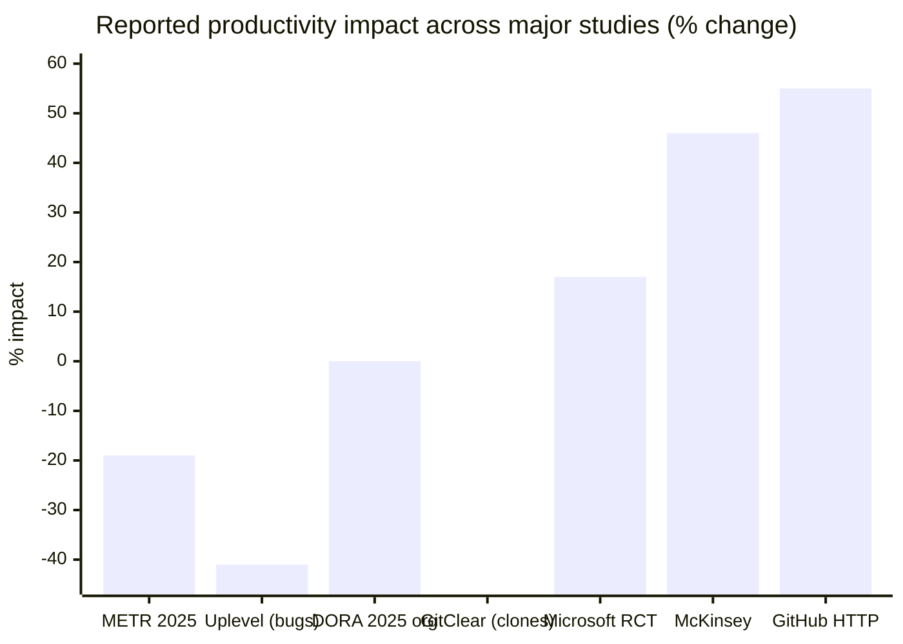

# The Research Is a Mess

I've read probably thirty studies on AI coding productivity at this point. They contradict each other constantly. Here's my attempt to make sense of the chaos.

The [METR study](https://metr.org/blog/2025-07-10-early-2025-ai-experienced-os-dev-study/) is the most rigorous. Sixteen experienced developers, 246 real tasks in codebases they actually maintained, proper randomization. The result? 19% slower with AI. Here's the part that keeps me up at night: the developers THOUGHT they were 20% faster. They had no idea the tools were slowing them down.

Then there's the [GitHub/Microsoft study](https://arxiv.org/abs/2302.06590) everyone cites for the "55% faster" claim. I have problems with this one. The task was writing a simple HTTP server from scratch, no existing codebase to understand, no architectural constraints, nothing that resembles actual work. Of course AI helps with that. It's basically an autocomplete benchmark.

The [Uplevel study](https://uplevelteam.com/blog/ai-for-developer-productivity) found 41% more bugs among Copilot users. [GitClear](https://www.gitclear.com/ai_assistant_code_quality_2025_research) found 4x more code duplication. [Faros AI](https://www.faros.ai/blog/ai-software-engineering) found individual productivity went up but PR review time increased 91%, eating all the gains and then some.

McKinsey's February 2026 study across 4,500 developers reportedly found 46% reduction in routine coding time. That's more optimistic than METR, but notice the qualifier: "routine coding" is a narrower claim than overall productivity. (I have not located a primary McKinsey URL for this specific finding. Treat the number as directional, sourced through secondary coverage; see [REFERENCES.md](../REFERENCES.md) for the verification status.)

Here's my synthesis: AI tools help with simple, well-defined, greenfield tasks. They hurt (or at best don't help) with complex, ambiguous, maintenance work. Most real software development is the latter, which is why the productivity gains don't always materialize.

▴ The contradiction visualized. METR/Uplevel/GitClear find quality regressions; Microsoft/McKinsey/GitHub find throughput gains. Both methodologies are sound; they're measuring different things on different populations.

> Full citations and links to these studies live in [REFERENCES.md](../REFERENCES.md).

## Related reading

- [Measuring what matters](../10-team-and-process/measuring-impact.md), DORA metrics, the hidden cost of PR review
- [Failure modes](../03-effective-use/failure-modes.md), why duplication and bugs go up
- [Research frontier](../11-frontier/research-frontier.md), what's still being studied
