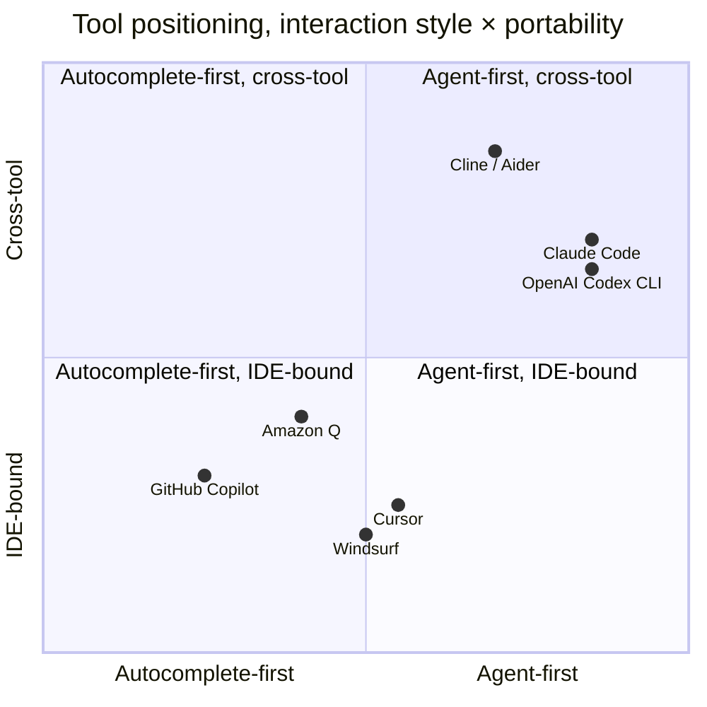

# Tools

Opinionated reviews of the tools the author has used daily. No "everything is wonderful" overview, each page says who the tool is *for* and what's wrong with it.

## At a glance

▴ Tool positioning. Approximate; based on April 2026 product positioning. The two corners that matter most for serious work: bottom-left (autocomplete-in-IDE) and top-right (agent-first, cross-tool).

| Tool | Best for | Watch out for |
|---|---|---|
| [GitHub Copilot](./github-copilot.md) | Path of least resistance in VS Code | Hasn't improved much in 2 years |
| [Cursor](./cursor.md) | Power users; codebase-aware editing | Pricing complexity; another IDE |
| [Claude Code](./claude-code.md) | Agentic, multi-file work; reading legacy code | Terminal-only; token cost |
| [OpenAI Codex](./openai-codex.md) | OpenAI ecosystem teams | Newer in this space |
| [Other tools](./other-tools.md) | Niche fits (AWS, free tier, OSS) | Mixed maturity |

> **Pricing note (April 2026).** Major tools moved from flat per-seat to usage-billed-on-top in early 2026. Serious daily users now land in the $150-250/month range for the primary tool, with secondary tools adding $20-60/month each. See [Recommended setup](./recommended-setup.md) for the current numbers.

## Read in order

1. [GitHub Copilot](./github-copilot.md)
2. [Cursor](./cursor.md)
3. [Claude Code](./claude-code.md)
4. [OpenAI Codex](./openai-codex.md)
5. [Other tools](./other-tools.md), Windsurf, Codeium, Amazon Q, Kiro, Antigravity, Cline/Aider
6. [Recommended setup](./recommended-setup.md), what the author actually uses

## Where to go next

- Get more out of any tool → **[03 — Effective use](../03-effective-use/)**
- Understand the workflow shift → **[05 — Workflows](../05-workflows/)** (specs, agents, skills)
- See what just shipped → **[Recent updates](../09-frontier/recent-updates-april-2026.md)**
