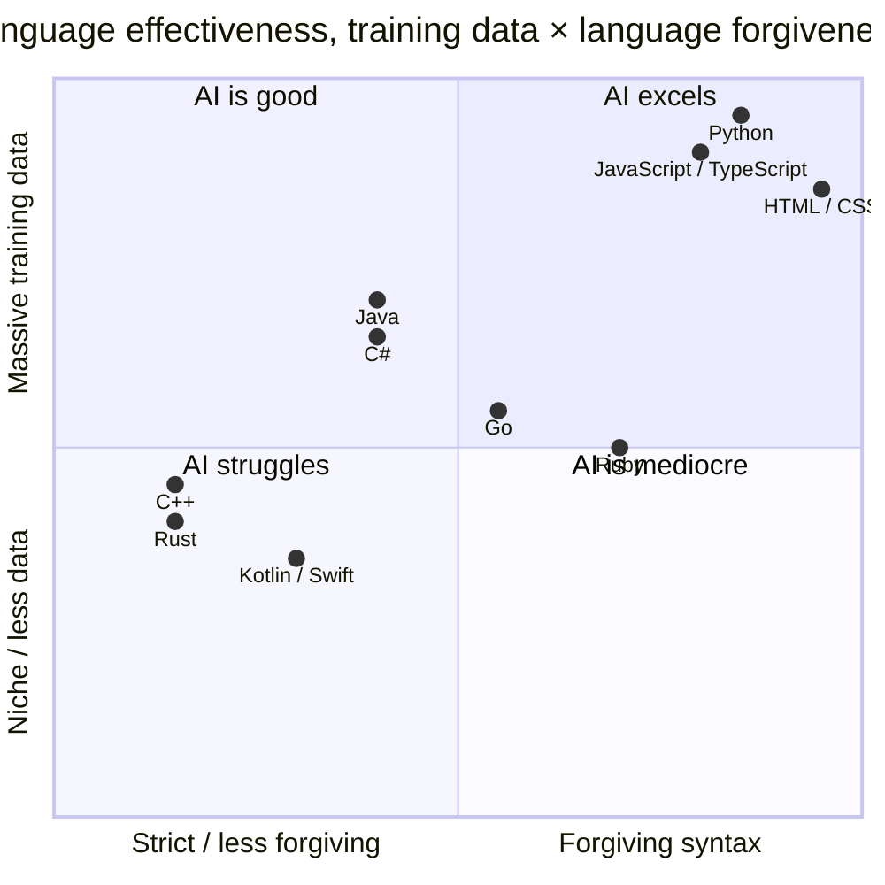

# Language and Framework Effectiveness

Not all code is created equal when it comes to AI generation. The effectiveness varies dramatically by language, framework, and task type.

## The Language Hierarchy

▴ Languages plotted by training-data volume × syntactic forgiveness. Top-right (Python/JS/TS) is where AI is most useful; bottom-left (Rust/C++) is where it most often produces code that looks right but doesn't compile.

Based on acceptance rates, benchmark scores, and my own experience, here's roughly how languages stack up for AI code generation.

**Tier 1 (AI excels):** Python, JavaScript/TypeScript, HTML/CSS. These have massive training data, well-established patterns, and forgiving syntax. AI achieves near 90% accuracy on Python benchmarks.

**Tier 2 (AI is good):** Java, C#, Go, Ruby, PHP. Strong training data, but more boilerplate and ceremony. AI handles common patterns well but struggles with framework-specific idioms.

**Tier 3 (AI is mediocre):** Rust, C++, Kotlin, Swift. Stricter type systems, memory management, or less training data. Rust is particularly hard because of ownership rules. AI often produces code that looks right but doesn't compile. Stack Overflow's 2025 survey found 45% of developers report debugging AI-generated code is time-consuming, and these languages are where that pain is most acute.

**Tier 4 (AI struggles):** Niche languages, proprietary frameworks, domain-specific languages. If it's not well-represented on GitHub, AI won't know it well.

## The Java Paradox

One finding from Veracode surprised me: AI performs worse on Java security than other languages, even though Java has decades of established security practices.

The hypothesis: models are over-trained on legacy Java patterns. Millions of lines of older Java code that predate modern security frameworks. When asked to write Java, AI defaults to patterns from 2010, not 2026.

This is a general lesson. **AI knows common code, not necessarily good code.** The most popular patterns in training data aren't always the best patterns for your use case.

## Framework Considerations

Frameworks matter as much as languages.

- **React/Next.js:** AI is excellent. Massive training data. But watch for outdated patterns: class components, old lifecycle methods, deprecated APIs. AI suggests what was common, not what's current.
- **Django/Flask:** Strong. Python frameworks with extensive documentation and examples. AI handles common patterns well.
- **Spring Boot:** Good for standard patterns. Struggles with complex configuration, custom annotations, enterprise integration patterns.
- **Ruby on Rails:** Decent, but the "magic" (conventions over configuration) means AI sometimes misses implicit behavior.
- **Newer frameworks (SvelteKit, Remix, etc.):** Weaker. Less training data. AI may not know recent API changes or best practices.
- **Internal frameworks:** AI knows nothing about your custom framework. You need extensive context files to get useful output.

## What This Means Practically

If you're evaluating AI tools for a project:

- **Python/JavaScript projects** will see the biggest gains. The tools are genuinely helpful here.
- **Enterprise Java/C# projects** need more careful review. AI suggestions may use outdated patterns.
- **Rust/C++ projects** require the most human oversight. AI often doesn't understand memory safety or ownership.
- **Niche stacks** may not benefit much. If your tech isn't well-represented on GitHub, AI won't help as much.
- **Always verify framework versions.** AI may suggest APIs that don't exist in your version, or deprecated patterns from older versions.

## Related reading

- [Where AI helps](./where-ai-helps.md), the general use-case framework
- [Security](../07-quality-and-security/threat-landscape.md), the Java security paradox in context
- [My experience](../01-foundations/my-experience.md), JS/TS gains in practice
