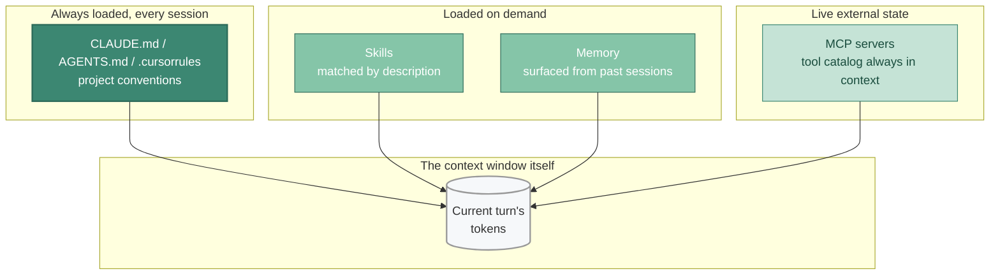

# Context Engineering: The New Core Skill

If [spec-driven development](../05-workflows/spec-driven-development.md) is the "what," context engineering is the "how."

Context engineering is the practice of curating what the AI sees. It's become the discipline that determines whether AI coding agents ship reliable code or generate expensive technical debt.

Birgitta Boeckeler at Thoughtworks calls it the "huge part of the developer experience of these tools." And she's right. I spend more time on context configuration now than I ever spent on prompt engineering.

## The Problem

LLMs have a finite attention budget. Every token in the context window competes for attention. As context grows, precision drops, reasoning weakens, and the model starts missing information it should catch.

Researchers call this **"lost in the middle."** Information in the middle of long contexts gets ignored. It's a real problem when your codebase context is 50,000 tokens and the critical constraint is somewhere in the middle.

OpenAI recommends fewer than 20 tools per agent, with accuracy degrading past 10. When you connect multiple MCP servers, you can easily hit 90+ tool definitions and 50,000 tokens of schemas before the model even starts reasoning.

## The Patterns That Work

▴ The four context-engineering primitives. Each loads at a different time; each has a different cost. Most rollout failures over-use one and under-use the others.

The major AI coding tools are converging on similar patterns.

- **Instruction files** (`CLAUDE.md`, `.cursorrules`, `AGENTS.md`) provide persistent context about your project. The AI reads these at the start of every session.
- **Skills** are descriptions of additional resources that the LLM can load on demand. Claude Code's [skills system](../05-workflows/skills-ecosystem.md) lets you package prompts, scripts, and documentation that activate when relevant.
- **Context routing** classifies queries and directs them to the right context source. A billing question doesn't need the onboarding knowledge base.
- **Memory systems** maintain information across sessions. This was a stub when the guide was first written; it's now an entire ecosystem (Claude memory, Copilot Memory, Codex Memories, claude-mem, Mem0, Letta, Zep/Graphiti, code knowledge graphs like graphify and GitNexus). See [06 — Skills & Memory](../06-skills-and-memory/) for the full treatment. Context engineering shapes the *current* turn; memory shapes *future* turns.

## What I've Learned

**Keep context files focused.** The ETH Zurich research found that more context often means worse results. Include what the AI genuinely can't infer from the code. Skip the obvious.

**Use hierarchical context.** Project-level context in the root. Module-level context in subdirectories. The AI loads what's relevant.

**Update context as you learn.** When the AI makes the same mistake twice, add a rule to prevent it. When it ignores a pattern, make the pattern explicit.

**Test your context.** Run the same task with and without context files. Measure the difference. Sometimes less is more.

## A Practical Example

For Cursor, I maintain a `.cursorrules` file in every project. Something like:

> Use TypeScript strict mode. Prefer functional components with hooks. Use the custom logger, not `console.log`. Error handling: wrap async calls in try-catch, use the `AppError` class. Tests go in `__tests__` directories, use Jest and React Testing Library.

That's it. Just a few rules. But it dramatically improves suggestions because the AI knows to use your patterns instead of generic ones.

For Claude Code, I put a `CLAUDE.md` file in the repo root with similar information, plus a brief overview of the architecture. Takes 10 minutes to write, saves hours of correcting bad suggestions.

The [Anthropic 2026 Agentic Coding Trends Report](https://resources.anthropic.com/2026-agentic-coding-trends-report) describes developers "developing intuitions for AI delegation over time." That's exactly right. You learn what context helps and what context hurts through experience.

## Related reading

- [The understanding problem](./understanding-problem.md), why context engineering exists
- [Spec-driven development](../05-workflows/spec-driven-development.md), the higher-level companion practice
- [Skills ecosystem](../05-workflows/skills-ecosystem.md), bundled, shareable context
- [Prompting patterns](../03-effective-use/prompting-patterns.md), what to do *after* context is set up
