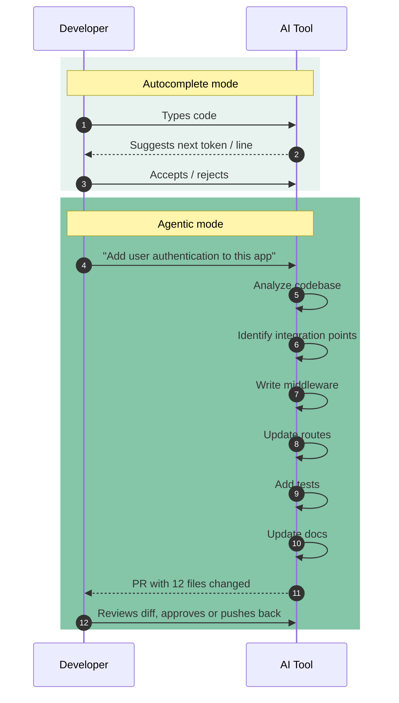

# The Agentic Shift

The biggest change in the last year isn't better autocomplete, it's agents. Tools like [Claude Code](../02-tools/claude-code.md), [OpenAI's Codex](../02-tools/openai-codex.md), and [Cursor](../02-tools/cursor.md)'s agent mode don't just suggest code. They execute multi-step plans.

This is a bigger deal than it might seem.

## What Actually Changed

With autocomplete, you're in the driver's seat. You type, AI suggests, you accept or reject, repeat. Every decision is yours.

With agents, you describe what you want and the AI figures out how. "Add user authentication to this application" becomes: analyze the codebase, identify where auth should go, write the middleware, update the routes, add tests, update documentation.

▴ The shift from autocomplete (one suggestion at a time) to agentic (multi-step plan execution). The risk profile is fundamentally different. See "The Risk Profile Is Different" below.

That's not science fiction. Claude Code does this today. Not perfectly, but well enough to be useful.

## When I Use Agents

**Refactoring.** "Rename the `UserService` class to `AuthenticationService` and update all references" is a perfect agent task. Boring, mechanical, spans many files, easy to verify.

**Test generation.** "Add unit tests for the `PaymentProcessor` class." The agent reads the code, understands what it does, generates tests. They're usually decent starting points.

**Documentation.** "Generate API documentation for the routes in `server/routes/`." Same pattern: read existing code, produce output. Great agent task.

**Onboarding.** "Explain the overall architecture of this project" when I'm diving into unfamiliar code. The agent explores, reads, synthesizes. Way faster than doing it myself.

## When I Don't Use Agents

**New features.** The agent doesn't know our product direction, our users, our constraints. It'll generate working code that misses the point entirely.

**Anything security-related.** Agents make mistakes. For auth, encryption, input validation, I want human eyes on every line. See [Security](../07-quality-and-security/threat-landscape.md).

**Complex architectural changes.** Agents can refactor within an architecture. They can't redesign the architecture itself. That requires judgment they don't have.

## The Risk Profile Is Different

With autocomplete, mistakes are small. You accept a bad suggestion, you notice quickly, you fix it. No big deal.

With agents, mistakes can be **systematic**. The agent makes a wrong assumption early and propagates it across twenty files. Now you're reviewing a diff with 400 changes and the bug is hiding somewhere in the middle.

My rule: always work in version control, always review the full diff, always run tests before committing. The agent can move fast, but you need to verify carefully.

## Controlling the Agent — The Harness Problem

Agents are powerful. They're also unpredictable. The challenge is giving them enough freedom to be useful without letting them go off the rails.

An "**agent harness**" is the scaffolding around an AI agent: the prompts, constraints, tools, and approval flows that shape what it does. Getting this right is becoming its own skill.

**My current setup for Claude Code:**

- `CLAUDE.md` in the repo root with architecture overview and conventions
- Explicit boundaries: "Do not modify files in `/legacy` without asking"
- Tool restrictions: "Do not run any destructive database commands"
- Approval gates: Any file creation or deletion requires confirmation

This isn't perfect, but it catches most of the "wait, why did you do that?" moments.

## The team coordination problem

Everything above is the *single-developer* view of agent work. The team view is a different problem and a harder one. Most agents run in private, local sessions. The plan is in the prompter's head; the prompts are on the prompter's machine; the first time anyone else sees the work is when the pull request opens. That's structurally bad: by the time the team can disagree, the code is already written.

GitHub's Labs team has been the loudest on this thesis ("one developer, two dozen agents, zero alignment") and is prototyping a tool called ACE that puts agent sessions into shared, multiplayer environments. I cover the broader argument and what teams can do today (without ACE) in [the alignment bottleneck](../08-team-and-adoption/alignment-bottleneck.md). If you're scaling agent use across a team, read that page next.

## Related reading

- [Spec-driven development](./spec-driven-development.md), what to hand to the agent
- [Skills ecosystem](./skills-ecosystem.md), packaged agent behaviors
- [Claude Code](../02-tools/claude-code.md), the author's primary agent platform
- [When things go wrong](../07-quality-and-security/when-things-go-wrong.md), debugging systematic agent mistakes
- [The alignment bottleneck](../08-team-and-adoption/alignment-bottleneck.md), the team-coordination problem agents create
