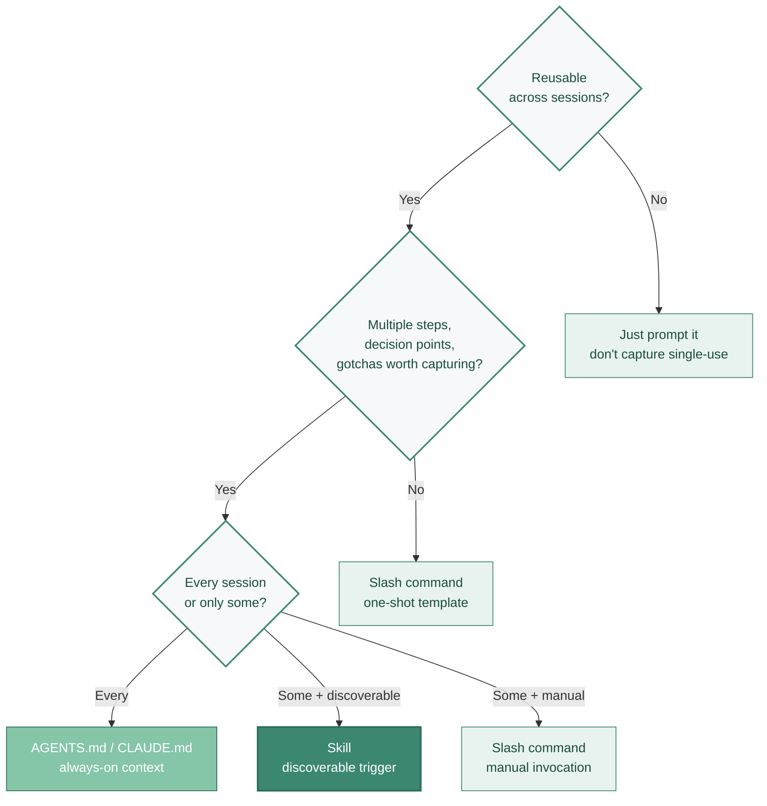

# Building Your Own Skills

Community skills are generic. Your codebase isn't. The highest-leverage skill I've ever written wasn't a clever methodology, it was just "use our `AppError` wrapper, don't propose generic try/catch." Took me 20 minutes to write. Saved me an argument with the agent every single PR thereafter.

This page is what I've learned from writing those, what works, what doesn't, what I wasted time on. If you haven't read the format basics on the "what are skills" page yet, start there.

---

## Anatomy of a good SKILL.md

Distilled from Anthropic's [skill authoring best practices](https://platform.claude.com/docs/en/agents-and-tools/agent-skills/best-practices), the [Complete Guide PDF](https://resources.anthropic.com/hubfs/The-Complete-Guide-to-Building-Skill-for-Claude.pdf), and what's actually working in production skills.

### 1. The description is everything

The description is the *only* thing in the system prompt for skill discovery. If it doesn't match the user's words, the skill never loads, no matter how perfect the body is.

I learned this the hard way. The first custom skill I wrote was a security checklist for our auth code. I poured probably four hours into the body. The description was something like *"Apply security best practices to authentication code."* It never fired. I'd write code that should have triggered it, the agent never loaded it, I never benefited. When I rewrote the description to *"Use this skill any time you're touching code in `auth/`, `session/`, or anything mentioning JWT, OAuth, login, signup, password, or token. Triggers include: 'add login', 'fix the auth', 'review this PR' if the diff touches auth files."*, it started firing.

Rules:
- Write in **third person**.
- Include both **what** the skill does and **when** to invoke it.
- Pack in **trigger phrases**: the words a user actually types, not the words an architect would use.
- 2–4 sentences is typical; this is one of the few places where verbosity helps.

### 2. Body under 500 lines / ~1,500–2,000 words

Most important instructions at the top. Bullet points and numbered lists, not dense paragraphs. I've found anything over ~300 lines starts hurting; the official guidance says 500 but that's a ceiling, not a target.

Canonical section order: Installation → Environment Variables → Authentication → Core Workflow → Features → Best Practices → Reference Files. Skip the sections you don't need.

### 3. Push beyond defaults

Skills should provide what the model *doesn't* already know. The `frontend-design` skill exists specifically because Claude defaults to Inter font and purple gradients ("AI slop") unless redirected. If your skill just tells the model to do what it would have done anyway, it's noise.

The test I run: read the skill body, then imagine the model with no skill loaded. Would the output be different? If not, the skill isn't earning its tokens. I've deleted maybe a third of the skills I've written this way.

### 4. Include a Gotchas section and update it

Real bugs found in real use are the highest-leverage content in any skill. Anthropic's `frontend-design` and Sentry's `commit` are both maintained primarily by adding gotchas as new failures appear.

A skill without a Gotchas section is a skill that hasn't met production yet. Mine usually grow one by week two.

### 5. Skills are folders, not files

Use the directory structure:

```
my-skill/
  SKILL.md
  scripts/         # helper scripts the agent can run
  references/      # long docs the agent loads on demand
  assets/          # templates, fixtures, sample files
```

The `references/` folder is where progressive disclosure pays off. Don't inline a 5,000-word style guide in `SKILL.md`, link to `references/style-guide.md` and the agent will load it when relevant.

### 6. Use progressive disclosure

Link to references with Markdown links rather than inlining. Example, inside a `SKILL.md`:

> `For the full enum of error codes, see references/error-codes.md.`

The agent loads referenced files only when the task touches them. This keeps Tier 2 (the body) lean.

---

## Testing your skill

Untested skills are aspirations. I default to A/B testing because it's the cheapest, and graduate to subagent pressure-tests when the skill is going into the team repo.

### A/B test (manual), the minimum

Run the same realistic task twice, once with the skill loaded, once without. Compare diffs. If the output isn't measurably better with the skill, remove it.

This sounds obvious. Most skills I've written failed this test on the first version, which is why testing matters.

### Subagent pressure-testing

The technique pioneered by [Superpowers' `writing-skills`](https://github.com/obra/superpowers/tree/main/skills/writing-skills): create a scenario, spin up a subagent, watch where it fails, strengthen the SKILL.md, retest. Treat skill authoring as **TDD for prompts**.

The key insight: subagents are stateless and start fresh, so they're a clean test environment. They surface gaps your own session has accumulated context to paper over. I've had skills work fine for me but completely fail in a fresh subagent session which is what would happen for any teammate using them.

### Cross-model evals

If you'll use the skill across models (Claude + GPT + Gemini), eval on each. gstack ships [`benchmark-models`](https://github.com/garrytan/gstack) for exactly this. A skill that works perfectly on Claude Opus 4.7 may behave very differently on Sonnet 4.6 or GPT-5.3-Codex.

I don't always do this. If I'm only using a skill in Claude Code, I skip cross-model. But for anything we ship to a team that uses multiple tools, it's worth the time.

---

## Versioning and maintenance

Treat `SKILL.md` like code. The basics:

- **Commit changes to Git.** Document in the message *why* behavior changed.
- **Roll back when degradations appear.** Skills can make output worse. I once added a "be more explicit about reasoning" instruction to a code review skill and PR review times doubled overnight. Reverted in 10 minutes; never made a "small tweak" without A/B testing again.
- **Hot-reload during iteration.** Claude Code 2.1.0 (January 2026) added skill hot-reloading; you don't have to restart sessions to test changes.
- **Stable IDs per skill.** If you rename, leave a redirect.
- **Pin third-party skill versions** in production. Don't auto-update community skills.

Enterprise patterns add: draft/publish workflow with tech-lead review, central sync, audit trail via Anthropic's `/v1/skills` endpoint, named skill owner per file.

---

## When to make a skill vs. a prompt vs. a context file

This is the most-asked question. The decision tree:


<p class="mermaid-caption">▴ When to make a skill vs. prompt vs. context file vs. slash command.</p>

**Rule of thumb:** when you find yourself re-explaining the same workflow more than 2–3 times, extract it into a skill. That rule alone catches most of the high-leverage candidates.

---

## How to extract a skill from working prompts

The pragmatic origin story for most useful skills: you find a prompt that consistently works, and you formalize it.

1. **Notice the pattern.** You've prompted the same thing several times. Save the working prompt.
2. **Identify triggers.** What words or contexts make you reach for it? Those become the description.
3. **Extract the structure.** Pull the *what* into the body. Pull any reference material into `references/`.
4. **Add gotchas.** What goes wrong when you don't include some specific instruction? Capture it.
5. **A/B test.** Compare with and without.
6. **Ship to your team's repo.**

Anthropic's [`skill-creator`](https://github.com/anthropics/skills) is the official meta-skill for exactly this workflow, start with it for your first one or two.

### Worked example: my `your-app-error-wrapper` skill

The example I keep coming back to in this guide: my team's `AppError` wrapper. Every time the agent wrote code that touched an error path, it produced a generic `try/except` (Python) or `try/catch` (TypeScript) and re-raised the original exception. Our convention is to wrap with a custom `AppError(code, message, context)` that the API layer turns into a structured error response. I'd spent six months of PR comments arguing with the agent about this.

**The repeated prompt that worked:**

> *"In this codebase, never propose a generic `try/except` or `try/catch` that re-raises. Every caught exception must be wrapped in our `AppError` class (defined in `lib/errors/app_error.py`). The wrap takes three arguments: a code from `lib/errors/codes.py`, a human-readable message, and a `context` dict with whatever local variables would help debugging. The original exception goes into `context['cause']` via `from e`. Do not invent new error codes; use existing ones from the codes module. If no existing code fits, surface that as a comment for me to resolve, don't make one up."*

**The skill I extracted from it (this is the actual `SKILL.md`):**

```markdown
---
name: your-app-error-wrapper
description: |
  Use this skill any time you generate code that catches an exception in this
  codebase. Enforces our AppError wrapping convention (lib/errors/app_error.py)
  with codes from lib/errors/codes.py. Triggers: any try/except, any except,
  any try/catch, any catch, any error-handling code, any "raise" you'd consider.
license: MIT
---

# Your AppError wrapper convention

## The rule
Never produce a bare `try/except` (or `try/catch`) that re-raises. Always
wrap with `AppError(code, message, context)` from `lib/errors/app_error.py`,
preserving the original via `from e`.

## The signature
- `code`: a value from `lib/errors/codes.py` (read it; never invent new codes)
- `message`: human-readable, no PII, generic enough to show to the client
- `context`: dict of local variables relevant to debugging this failure
- Always `raise AppError(...) from e` to preserve the cause chain

## Examples (good)
... [3 short examples from real code] ...

## Examples (bad — these are the patterns AI keeps generating)
... [3 anti-patterns: bare `except: pass`, re-raise without wrap,
  inventing a new code] ...

## Gotchas
- The `context` dict gets serialized; don't put unserializable objects in it
  (DB sessions, file handles, full request bodies). Put their identity, not
  their content.
- For exceptions that bubble from a third-party library we don't control,
  the code is `EXTERNAL_<LIBNAME>` (e.g., `EXTERNAL_REDIS`). Don't make up
  domain-specific codes for these.
- If you genuinely don't know which code applies, leave a TODO comment
  rather than picking the closest one. I'd rather review a TODO than
  re-do a wrong wrap.
```

**What changed after I shipped it:** the next 30 PRs I generated touched error paths. Zero needed correction on this convention. The agent stopped re-discovering the wrapper from scratch every session. The skill took me about twenty minutes to write; it has saved me, conservatively, an hour a week ever since.

**Two things I'd flag from this example:**

1. *The "Examples (bad)" section is the most valuable part of the skill.* It targets the *specific* failure modes I kept seeing. A generic style guide would not have done this; the skill works because it knows exactly what shape the AI's bad output takes.
2. *The skill's description was rewritten three times before it reliably triggered.* My first version said "use when handling errors" — too vague, the agent never loaded it. The version above lists every keyword (`try/except`, `try/catch`, `raise`, `error-handling`) the agent would produce while writing error code. Discovery is the load-bearing thing; the body is secondary.

---

## Real-world skills worth studying

Don't write your first skill from scratch. Read these first, they're the canonical examples I keep coming back to:

> 💡 This repo also ships a working example: [`skills/skill-recommender/`](https://github.com/pochadri/ai-coding/tree/main/skills/skill-recommender) is an installable SKILL.md that demonstrates discovery questions, decision rules, progressive-disclosure references, and a structured dual-output (install set + custom-write set). Read its `SKILL.md` and `references/` files as a working template.


- **[`anthropics/skills/skills/skill-creator/SKILL.md`](https://github.com/anthropics/skills)**: the official meta-skill for authoring others
- **[`anthropics/skills/skills/frontend-design/`](https://github.com/anthropics/skills)**: gotchas-driven, evolves with model behavior
- **[`obra/superpowers/skills/test-driven-development/SKILL.md`](https://github.com/obra/superpowers)**: strict methodology in skill form
- **[`obra/superpowers/skills/writing-skills/`](https://github.com/obra/superpowers/tree/main/skills/writing-skills)**: TDD for skills; the pressure-test pattern
- **[`trailofbits/skills/plugins/variant-analysis/`](https://github.com/trailofbits/skills)**: methodology over checklist, confidence-graded findings
- **[`getsentry/skills/.../skill-scanner/SKILL.md`](https://github.com/getsentry/skills)**: a skill that audits other skills (meta and instructive)
- **[`mattpocock/skills/tdd/`](https://github.com/mattpocock/skills)**: concise, opinionated TS-flavored TDD
- **[`livekit/agent-skills`](https://github.com/livekit/agent-skills)**: exemplary architecture-vs-API split for staleness avoidance

If you only read two of these, make it `skill-creator` and `frontend-design`. They're the most generally instructive.

---

## Team practices

When a skill goes from "your kit" to "the team's kit":

- **Named owner per skill** in a `CODEOWNERS` file on the skills repo.
- **PR review** for any change to `.claude/skills/` like any other code.
- **Subagent pressure-tests committed alongside the skill**, run in CI on PR.
- **Draft / publish workflow** for organizations: draft → tech lead reviews → published version syncs to team.

The teams that don't do this end up with the small-team failure mode: three engineers, three different `~/.claude/skills/` directories, three different agent behaviors on the same codebase. Get to PR review on skills earlier than feels necessary.

## Related reading

- [What are skills](./what-are-skills.md), the format and the open standard
- [Quality and anti-patterns](./quality-and-anti-patterns.md), failure modes to defend against
- [Choosing skills](./choosing-skills.md), when *not* to write your own
