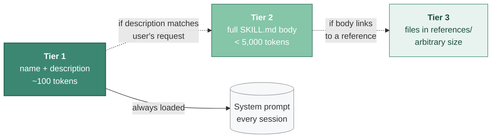

# What Are Skills

A skill is a packaged prompt + workflow + instructions that teaches an AI coding tool how to do a specific task well. Where `CLAUDE.md` is *always-on* project context and MCP gives you *live external connectivity*, a skill is *procedural know-how* that the agent loads on demand when the task matches.

That distinction took me a while to internalize. I'd been treating `CLAUDE.md` as a dumping ground for everything I wanted Claude to remember, and my agent's output kept getting worse the more I added. Skills are the answer to "I want the model to know this *when it's relevant*, not always." Once that clicked, my context files got smaller and my output got better.

## The `SKILL.md` format

A skill is a folder. Inside it sits a `SKILL.md` file with YAML frontmatter, plus optional `scripts/`, `references/`, and `assets/` subdirectories.

The frontmatter has two required fields:

```yaml
---
name: docx
description: "Use this skill whenever the user wants to create, read, edit, or
  manipulate Word documents (.docx files). Triggers include: any mention of
  'Word doc', 'word document', '.docx', or requests to produce professional
  documents with formatting like tables of contents, headings, page numbers,
  or letterheads."
---
```

- **`name`**: lowercase-hyphens; becomes the skill's identifier and (in some tools) its slash command.
- **`description`**: the *single most important field*. It's the only thing the model sees during skill discovery. It must say both *what* the skill does and *when* to invoke it, written in third person, packed with trigger phrases.

Optional frontmatter includes `license`, `allowed-tools`, and tool-compatibility hints. The body is plain Markdown. Anthropic recommends staying under 500 lines / ~1,500–2,000 words; I've found anything over ~300 actually starts to hurt. Detailed reference content lives in `references/` and is loaded only when needed. ([Anthropic best practices](https://platform.claude.com/docs/en/agents-and-tools/agent-skills/best-practices))

### Why descriptions matter so much: progressive disclosure

The clever bit is a three-tier loading model:


<p class="mermaid-caption">▴ Three-tier progressive disclosure. With 10 skills installed: ~1,000 baseline tokens vs. ~10,000 for monolithic prompts — ~90% baseline-context reduction.</p>

| Tier | What loads | When | Cost |
|---|---|---|---|
| 1 | `name` + `description` | Always (system prompt) | ~100 tokens |
| 2 | Full `SKILL.md` body | When description matches the user's request | < 5,000 tokens |
| 3 | Files in `references/` | Only if the body links to them | On demand |

With 10 skills installed this is roughly **1,000 baseline tokens** vs. ~10,000 for monolithic prompts, about a 90% baseline-context reduction.

This is also why a vague description is fatal. I've had skills I poured hours into that never fired in real use because the description didn't match how I actually phrased my requests. The body could be perfect; if Tier 1 doesn't trigger, you'll never see it.

## Skills vs. their neighbors

Several adjacent concepts get confused. Here's how I think about them:

| Mechanism | What it provides | When it loads | Use for |
|---|---|---|---|
| **Skill** | Procedural how-to (a workflow) | On demand, when description matches | Repeatable workflows with steps, decisions, gotchas |
| **`CLAUDE.md` / `AGENTS.md`** | Always-on project context | Every session, every prompt | Architecture, conventions, invariants |
| **`.cursorrules`** | Cursor's equivalent of `CLAUDE.md` | Every session in Cursor | Same as above, Cursor-specific |
| **[Memory](../07-memory/)** | Learned, persistent state across sessions | Surfaced into future turns by the agent itself | Cross-session decisions, project conventions the agent learns over time |
| **MCP server** | Live connectivity to external tools/data | Tool catalog always in context | GitHub API, AWS, databases, anything stateful |
| **Slash command** | User-invoked prompt template | Manually, when user types `/foo` | One-shot prompts you'll always trigger yourself |
| **Plugin** | Distribution wrapper | Holds skills, MCP, hooks, commands | Bundling a coordinated set of the above |

Two practical takeaways from getting both wrong over the past year:

1. **Don't dump everything into `CLAUDE.md`.** It's always loaded, every prompt, competing for attention. Conditional things belong in skills.
2. **Don't reach for MCP when a skill will do.** I once had five MCP servers connected — GitHub, a couple of databases, a docs server, and Linear. That's roughly 55,000 tokens of tool definitions loaded *before* the model starts reasoning. My output noticeably degraded. I uninstalled four of them and moved the procedural how-to into skills. Output snapped back.

`AGENTS.md` is worth special note: it's the **multi-vendor open standard** for the always-on context file, stewarded by the Linux Foundation's Agentic AI Foundation. Adopters include Sourcegraph, OpenAI, Google, Cursor, and Factory. `CLAUDE.md` is the Anthropic-specific equivalent. Cursor reads both. Most modern projects I've seen use `AGENTS.md` as the canonical file with `CLAUDE.md` as an optional supplement.

## The open standard, and what works where

Anthropic released `SKILL.md` as an open standard at **[agentskills.io](https://agentskills.io/specification)** on December 18, 2025. Since then it's been adopted by:

- **Microsoft** (VS Code, GitHub), natively supported; `gh` CLI gained skills management on April 16, 2026
- **Cursor**: reads SKILL.md via the open standard
- **OpenAI Codex CLI**: launched "Skills in Codex" in December 2025
- **Goose, Amp, OpenCode, Gemini CLI, Pi, Aider**: all support the format

Most differences across tools are surface-level: where the skill folder lives (`.claude/skills/`, `.codex/skills/`, etc.) and which optional frontmatter fields are honored. Multi-tool installer CLIs (`npx skills`, `npx antigravity-awesome-skills`) translate the same skill folders across tools.

The notable outlier is **gstack**: Garry Tan informally calls his slash-command markdown files "skills," but they're technically Claude Code custom slash commands, no YAML frontmatter convention, always user-invoked. Functionally similar; format-wise distinct. If you adopt gstack you're locked into Claude Code (which may be fine).

## Discovering skills

The places I actually look:

- **Anthropic's Claude Marketplace**: launched March 7, 2026. First-party storefront, but the curation is light. Worth browsing.
- **[`VoltAgent/awesome-agent-skills`](https://github.com/VoltAgent/awesome-agent-skills)** (1,400+ skills, hand-curated), this is the list I use most often.
- **[`sickn33/antigravity-awesome-skills`](https://github.com/sickn33/antigravity-awesome-skills)**: 1,435+ skills *with an installer CLI*, which is the killer feature.
- **GitHub topic search**: `claude-code-skills`, `agent-skills`, or filename `SKILL.md` if you want to fish.
- **Third-party registries**: `skills.sh`, `claudeskills.info`, `polyskill.ai`, `lobehub.com/skills`. I've used these less; quality varies.

For everything I'd avoid in skill discovery, see [Quality and anti-patterns](./quality-and-anti-patterns.md).

## Installing skills

Several install paths exist:

- **Anthropic's first-class flow:**
  ```
  claude plugin marketplace add <org>/<repo>
  claude plugin install <plugin>@<marketplace>
  ```
- **Vercel's open multi-tool CLI**: `npx skills add <package>` (works with 18+ agents)
- **Antigravity catalog installer**: `npx antigravity-awesome-skills --claude --category development,backend --risk safe`
- **GitHub CLI (April 2026+)**: `gh` natively manages agent skills
- **Manual**: `git clone` into `~/.claude/skills/` (user-wide) or `.claude/skills/` (project-local, checked into Git)

For anything beyond solo use, project-local with Git is the answer. I've gotten too many "wait, why does my agent behave differently than yours" moments from user-wide installs to recommend anything else for teams.

## Related reading

- [Ecosystem landscape](./ecosystem-landscape.md), the libraries worth knowing
- [Choosing skills](./choosing-skills.md), what to install for your project
- [Building your own](./building-your-own.md), write skills that earn their tokens
