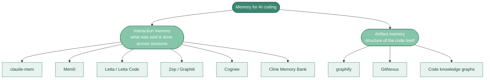

# What Is Memory

The way I think about it now: **context shapes what the model sees this turn. Memory shapes what's still there next turn.** Everything else is a detail of how that's implemented.

For two years I confused the two. They look similar. They both end up as tokens in the context window. But they're mechanically different and the field is finally settling on terminology that makes the distinction clear.

## Memory vs context vs skills vs RAG

| Mechanism | When it loads | Who curates it | Persists across sessions? |
|---|---|---|---|
| **Context** (the window itself) | This turn only | Nobody, it's the buffer | No |
| **`AGENTS.md` / `CLAUDE.md`** | Every turn (always) | You, manually | Yes, but static |
| **[Skills](../06-skills/)** | When description matches | You, manually | Yes, but static |
| **MCP servers** | Tool catalog always loaded | Vendor / you | Stateful, but live (not learned) |
| **RAG** | Retrieves chunks every turn | You set up the corpus | Corpus persists; retrieval is per-turn |
| **Memory** | Surfaced into future turns | The agent (or user) writes it | **Yes and it's *learned*, not authored** |

The distinguishing trait of memory: **the write side**. Skills and context files are authored by humans. RAG indexes a corpus humans wrote. Memory is written *by the agent itself* (or about it) during use, then retrieved later. Karpathy's recent critique made this concrete: ["RAG rereads the same books for every exam, never actually learning the material"](https://gamgee.ai/blogs/karpathy-llm-wiki-memory-pattern/).

This matters in practice because memory introduces concerns the others don't: poisoning, staleness, privacy. We'll get to those in [Practice and risks](./practice-and-risks.md).

## The four CoALA memory types

The 2023 Princeton CoALA paper has become the lingua franca for talking about agent memory. Four types, mapped from cognitive science:

| Type | Cognitive analog | What it stores | Coding example |
|---|---|---|---|
| **Working** | Short-term scratch | Current decision cycle's active state | The agent's chain-of-thought for the task at hand |
| **Episodic** | Past experiences | Logs of past sessions, conversations, actions | "Last week we tried Redis Streams for the event bus, switched to NATS due to backpressure" |
| **Semantic** | General knowledge | Generalized facts and rules | "This codebase uses the `AppError` wrapper, not generic try/catch" |
| **Procedural** | Skills / how-to | Learned skills, agent code, system prompt | The agent itself, plus any installed [skills](../06-skills/) |

Most "memory" tools target *episodic* and *semantic*. Skills are *procedural* memory in disguise. The model weights themselves are also procedural memory, frozen at training time.

If you're reading vendor pitches, you'll see this taxonomy referenced constantly without attribution. It's the right framework. ([IBM's overview is solid](https://www.ibm.com/think/topics/ai-agent-memory).)

## The two sub-problems memory solves

▴ The two sub-problems memory solves. Most teams need both layers, they solve different problems and rarely overlap.

Underneath the CoALA types, there's a more practical split that I think is more useful for *choosing tools*:

### Interaction memory

What was *said and done* across past sessions: decisions made, conversations had, errors hit, fixes that worked, your preferences, the team's preferences.

Tools in this camp: **claude-mem, Mem0, Letta + Letta Code, Zep/Graphiti, Cognee, ByteRover, Cline Memory Bank, Basic Memory**, and most of the vendor-native memory features (Claude memory, Copilot Memory, Codex Memories).

These are the right answer when the problem is *"the agent forgets what we already decided."* Detailed treatment: [Interaction memory tools](./interaction-memory.md).

### Artifact memory

The structure of the *code itself*, call graphs, imports, type relationships, dependency chains. Built once (or incrementally), queried every session.

Tools in this camp: **graphify, GitNexus**, and a handful of related code-knowledge-graph approaches.

These are the right answer when the problem is *"the agent doesn't understand my codebase's architecture, even with the files in front of it."* They reject the pure vector-DB / RAG approach and treat the AST + call graph as ground truth. Detailed treatment: [Artifact memory](./artifact-memory.md).

### Why the split matters

When I started thinking about this folder, I was going to write a single "tools" page. The two-camp distinction kept emerging from the research, and once I started thinking in those terms, recommendations got sharper. Most teams who think they need memory actually need *both* layers, interaction memory for "what we decided" + artifact memory for "what's where" and choosing wrong is expensive. A vector-DB conversational memory tool won't help you understand a 200K-LOC codebase's call graph. A code knowledge graph won't remember why you abandoned a particular library.

## The "1M tokens will solve everything" argument

You'll hear: *"Context windows keep growing. At some point they'll be big enough that memory becomes unnecessary."*

This is mostly wrong, for a few reasons that have hardened into consensus over the last year:

- **Lost-in-the-middle.** Recall degrades for content buried in long contexts. A 1M-token window doesn't equal 1M tokens of usable attention. ([Mem0's writeup of this is good](https://mem0.ai/blog/context-window-vs-persistent-memory-why-1m-tokens-isn-t-enough).)
- **Context rot.** Accuracy drops as token count grows, even within the model's stated window.
- **Quadratic cost.** 200K → 1M tokens is roughly 25× more compute. You don't want to pay that on every turn.
- **They solve different problems.** Big context is what the model sees *this turn*. Memory is what survives *across* turns. Even if context were free and infinite, you'd still want a curated, learned, persistent layer rather than re-cramming raw history every session.

The empirically-emerging compromise is what Augment calls **layered persistence**: `AGENTS.md` for team conventions (static, always-on), agent memory for decision histories (dynamic, learned, persistent), and a living spec for current state. Three tiers, three different update cadences.

## The MCP-based memory pattern

Worth flagging because it's quietly become *the* dominant integration shape for non-vendor memory: **expose memory via an MCP server**, agnostic to the AI tool. Anthropic ships [an official MCP memory server](https://github.com/modelcontextprotocol/servers/tree/main/src/memory). Graphiti, claude-mem, Basic Memory, Memorix, Context-Sync, ByteRover all expose MCP. Even GitNexus is MCP-first.

This means most modern memory tools are tool-agnostic by construction. You install the MCP server once; it works in Claude Code, Cursor, Codex, anything that speaks MCP. That's a meaningful change from a year ago when each tool had its own incompatible memory format.

## Related reading

- [Vendor-native memory](./vendor-native.md), what's already in your IDE
- [Interaction memory tools](./interaction-memory.md), third-party layers for episodic/semantic memory
- [Artifact memory](./artifact-memory.md), code knowledge graphs as memory
- [Context engineering](../04-understanding-and-context/context-engineering.md), the lower-level companion practice
