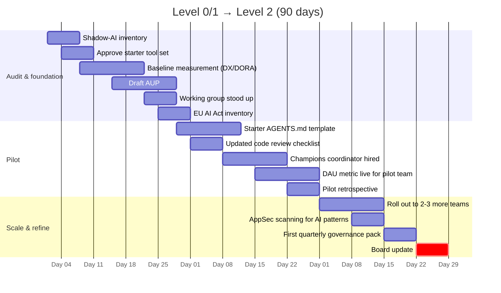
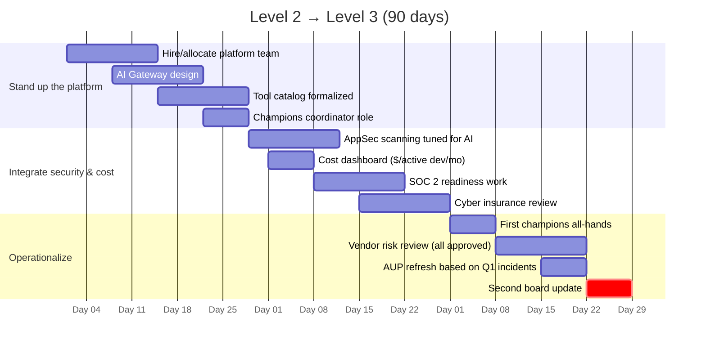
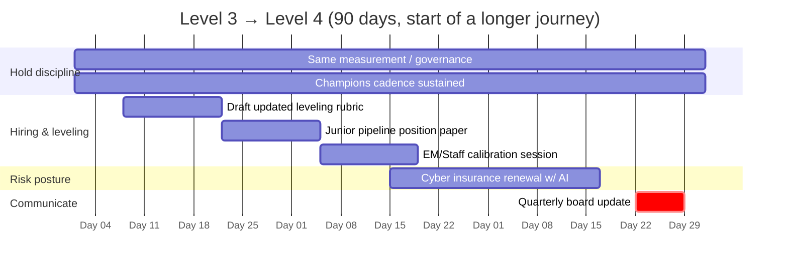

# The 90-Day Roadmap

Most "AI strategy" decks I see have a five-year vision and no Tuesday-morning starting point. What follows is three concrete 90-day plans, one for each common starting maturity level (0/1, 2, 3), that I'd actually hand to a peer who said "okay, I'm convinced; what do I do Monday?"

If you don't know your level, take the [maturity assessment](./assessment.md) first.

A note on framing: the [Stanford Digital Economy Lab's *Enterprise AI Playbook* (March 2026)](https://digitaleconomy.stanford.edu/app/uploads/2026/03/EnterpriseAIPlaybook_PereiraGraylinBrynjolfsson.pdf) studied 51 successful deployments and the structural finding I'd lean on hardest is this: **CEO ownership, not CTO delegation**. The orgs that succeed treat AI rollout as a CEO-level commitment with the CTO as the operator. Orgs where the CEO offloads it to the CTO and disengages tend to stall.

Everything below assumes that engagement at the top.

---

## If you're at Level 0 or 1 → 90 days to Operational

The goal is to get to Level 2, measured, governed, with `AGENTS.md` everywhere and code review actually updated. Don't skip levels; you'll regret it.

▴ Level 0/1 → Level 2. Critical path: baseline measurement *before* rollout (you can't reconstruct the baseline after).

### Days 1–30: Audit and foundation

**Owner: CTO + a designated lead (could be a senior eng manager, ideally not part-time).**

| Week | Action | Output |
|---|---|---|
| 1 | Shadow-AI inventory: network egress to AI vendor domains, browser extension audit, expense-report review | A list of every AI tool currently in use |
| 1 | Approve a starter set: Copilot OR Cursor OR Claude Code, plus one secondary | Vendor decision; budget allocated |
| 2 | Baseline measurement: pick DX Core 4 OR DORA + a daily-active-usage metric. **Capture the baseline numbers before the rollout, not after.** | Baseline dashboard live |
| 2–3 | Draft AUP (start from the template in the templates folder, have legal compress it) | Published AUP, cross-functional sign-off |
| 3–4 | Stand up the working group: one CTO sponsor, one DevEx lead, one security partner, one representative engineer per major team | Working group meeting cadence; first meeting held |
| 4 | EU AI Act inventory + classification (if you have any EU footprint) | Classification decisions documented |

The honest version: most orgs spend Week 1 surprised by what the shadow-AI inventory turns up. Budget for that.

### Days 31–60: Pilot

**Owner: DevEx lead with CTO sponsorship.**

Pick **one team** where pain is sharp and measurement is clear (Booking.com's pattern was a single product team with strong measurement culture). Don't pilot in three places at once, you can't draw conclusions.

| Week | Action | Output |
|---|---|---|
| 5 | Ship a starter `AGENTS.md` template; require it in the pilot team's main repo | Template in use |
| 5–6 | Update the pilot team's code review checklist for AI-generated code | Updated checklist; first PRs reviewed against it |
| 6 | First champion-network coordinator hired or designated | Role exists; first office hours scheduled |
| 7–8 | Daily-active-usage metric live for the pilot team; weekly review | Baseline → 4-week trend |
| 8 | Pilot retrospective: what's working, what's friction | Decision document for scale-up |

### Days 61–90: Scale and refine

**Owner: DevEx lead.**

| Week | Action | Output |
|---|---|---|
| 9–10 | Roll out to 2–3 additional teams; champions network expands proportionally | Coverage metric; champion ratio approaching 5–10% target |
| 10 | AppSec scanning for AI patterns turned on (Snyk / Semgrep / equivalent rules) | First findings reviewed |
| 11 | Governance review: AUP enforcement, tool-catalog updates, cost trajectory | First quarterly governance pack |
| 12 | Board update: bimodal productivity narrative, three-number dashboard, what's next | Board-ready slide pack |

**Exit criterion for Level 2:** you can answer all three of these with data, not anecdote, by day 90. (1) What's our daily active usage rate? (2) What's our cycle time trend? (3) What's our defect escape rate trend?

If you can't, don't claim Level 2 yet.

---

## If you're at Level 2 → 90 days to Platformed

Goal: Level 3. The platform exists; AI Gateway is live; tool catalog is real; champions network is staffed; security scanning is integrated. The expensive things start now, but the foundation is good enough to actually use them.

▴ Level 2 → Level 3. The platform team is the load-bearing investment; everything else follows from it.

### Days 1–30: Stand up the platform

| Week | Action |
|---|---|
| 1–2 | Hire / allocate the platform team (2–3 FTE for a 200-eng org, 5–8 for a 1,000-eng org) |
| 2–3 | AI Gateway design: pick the pattern (Cloudflare-style centralized routing, or a lighter MCP-gateway pattern). [Cloudflare's published model](https://blog.cloudflare.com/internal-ai-engineering-stack/) is the reference. |
| 3–4 | Tool catalog formalized: sandbox / approved / prohibited tiers documented; quarterly review cadence set |
| 4 | Champions network coordinator role: explicit time allocation (30–60 min/week per champion, per the Citi model) |

### Days 31–60: Integrate security and cost

| Week | Action |
|---|---|
| 5–6 | AppSec scanning specifically tuned for AI patterns (Apiiro, Semgrep, or in-house rules for the [322% privilege-escalation pattern](https://apiiro.com/blog/4x-velocity-10x-vulnerabilities-ai-coding-assistants-are-shipping-more-risks/)) |
| 6 | Cost dashboard: $/active dev/month per team; alerts on outliers |
| 7 | SOC 2 readiness: AI-generated code attribution, audit trails |
| 8 | Cyber insurance review with broker, explicit AI coverage at next renewal |

### Days 61–90: Operationalize

| Week | Action |
|---|---|
| 9 | First champions-network all-hands; pattern library v1 published |
| 10 | Vendor risk review on all approved tools (indemnification, ZDR, residency) |
| 11 | Refresh AUP based on first quarter's incidents and friction |
| 12 | Second board update: cost trajectory, security findings, adoption plateau or growth |

**Exit criterion for Level 3:** the platform team can hold its own at a CFO-led cost review without scrambling for data.

---

## If you're at Level 3 → 90 days to Compounding

Goal: Level 4. This is the hardest transition because the productivity gains have to *hold* for two more quarters and the org has to absorb hiring/leveling/junior-pipeline changes that take time. 90 days is the start, not the finish.

▴ Level 3 → Level 4. Note "Hold discipline" runs the full 90 days, novelty creep is the failure mode here.

### Focus the quarter on three things, in order

1. **Hold the discipline.** Same measurement; same governance; same champions cadence. Resist the urge to add more tools or more programs. The thing that fails Level 3→4 transitions is *novelty creep*.
2. **Bake AI into hiring and leveling.** Two-quarter rollout; this quarter is the rubric draft + calibration.
3. **Junior pipeline strategy.** Pick a defensible position (Camille Fournier's "smaller teams not juniorization," or a Garman-style "hire what you can mentor"). Document it. Communicate it.

### Specific deliverables

| Week | Action |
|---|---|
| 2 | Draft updated leveling rubric with AI fluency dimension |
| 4 | Junior pipeline position paper (1 page, CTO-signed) |
| 6 | Calibration session with EMs/Staff+ on the new rubric |
| 8 | Cyber insurance renewal with explicit AI coverage |
| 12 | Quarterly board update with the bimodal narrative + 6-month productivity trend |

**Exit criterion for Level 4:** measurable productivity gain, no quality regression, holding for 6 months.

---

## What I tell CTO peers about sequencing

Three patterns I see fail:

**Pattern 1: Measure last.** "We'll get the tools in first, then figure out measurement." You'll never recover the baseline. Measure first, even if the measurement is bad — *some* measurement before rollout beats *good* measurement after.

**Pattern 2: Govern last.** "We'll write the AUP once we hit a problem." When you hit a problem, the problem is a security incident, not a polite training opportunity. Write the AUP in week 4, not week 24.

**Pattern 3: Scale before pilot.** "Let's roll out to all teams at once." You can't draw conclusions; you can't iterate; you can't build the champions network. One team, eight weeks, then expand.

The boring sequence, audit → measure → pilot → scale → integrate → operationalize, is what works. The interesting sequences (jump straight to autonomous agents! roll out to 3,000 devs in week 1!) are what makes for great press releases and bad outcomes.

---

## Related reading

- [Maturity model](./maturity-model.md), to know which 90-day plan applies to you
- 📊 [Maturity assessment](./assessment.md), if you don't know your level
- [Org design](./org-design.md), for the platform team and champions detail
- [Risk, governance, policy](./risk-governance-policy.md), for the AUP and EU AI Act work in Days 1–30
- [Case studies](./case-studies.md), Booking.com's pilot pattern in detail
