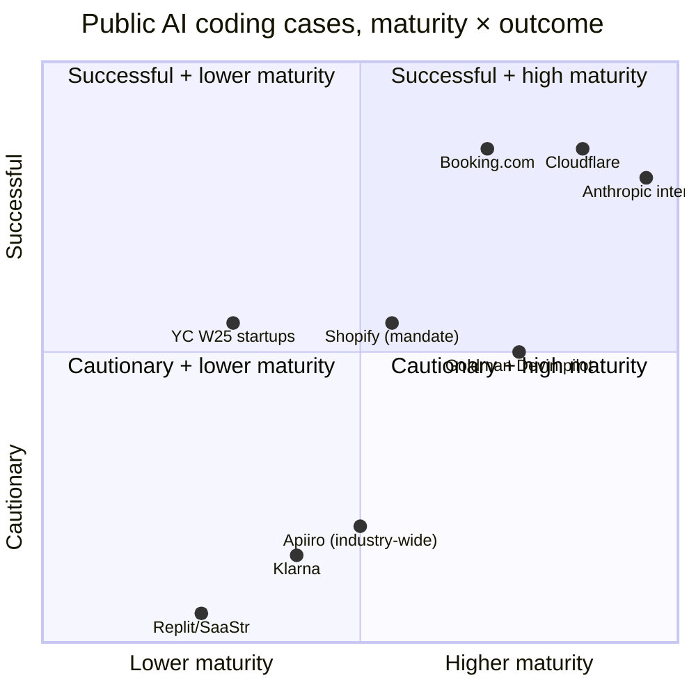

# Case Studies — What Worked, What Didn't

> **TL;DR.** Read **Booking.com** for the gold-standard rollout (the deployment-vs-daily-active-usage pivot is the most-instructive operational decision in this space) and **Replit/SaaStr** for the cautionary tale (autonomous agent + production access = predictable disaster). The other seven cases are useful supporting evidence.

I trust case studies more than vendor decks. Real companies, real outcomes (sometimes painful), real numbers, usually self-disclosed in blog posts, conference talks, or in the case of failures, news coverage they didn't choose. The ones I keep referencing follow.

The pattern I'd hold onto: **the gold-standard rollout (Booking.com) and the cautionary tale (Replit/SaaStr) cost roughly the same to study. Read both.**

---

## ✅ Booking.com, the gold-standard rollout

If I could only point a CTO at one case study, it'd be this one. Booking.com scaled AI coding tool adoption from below 10% to **70% across 3,000+ developers**. The interesting part isn't the number, plenty of orgs have hit 70% adoption, it's how they *got unstuck* when adoption stalled.

What happened in the middle: their measurement partner (DX) identified that the bottleneck wasn't access, it was enablement. The teams that weren't adopting weren't blocked on licenses; they were blocked on *not knowing how to use the tools well*. So Booking pivoted the success metric. Out went "% of developers with the tool deployed" (vanity). In came "**daily active users** (12+ days/month)" (real). And once they were measuring DAU, daily active users turned out to have **16% higher change throughput** than non-users which gave them both the executive air cover *and* the targeting precision to focus enablement on the teams actually below the DAU bar.

The operational subtlety here is what I keep returning to. The pivot from "tool deployed" to "daily active usage" is the single most-instructive decision I've seen documented in this space. It's the thing that distinguishes "rollout in a press release" from "rollout that compounds." If you do nothing else from this folder, copy that pivot.

Sources: [DX customer story](https://getdx.com/customers/booking-uses-dx-to-measure-impact-of-genai/) · [Booking drives AI adoption with DX](https://getdx.com/customers/booking-drives-ai-adoption-with-dx/)

---

## ✅ Cloudflare, the platform team template

Most "we built AI infrastructure" writeups stay vague, they tell you the outcome but not the components. Cloudflare's [internal AI engineering stack post](https://blog.cloudflare.com/internal-ai-engineering-stack/) does the opposite. It names the pieces, the design choices, and the operational pattern. **3,683 internal users**, **60% company-wide adoption (93% across R&D)**, every LLM request routed through their AI Gateway for auth + cost tracking + retention policy enforcement, auth via Cloudflare Access with zero-trust policies. It reads like documentation rather than marketing.

The reason I keep returning to it is that it's the cleanest public template for what a Level 3 platform team actually *owns*. The AI Gateway pattern in particular is not optional past Level 2, centralized routing is the only way I've seen retention-policy enforcement work at scale, the only reliable way to convert shadow AI into measurable AI, and the only way to keep cost predictable when usage-based pricing took over in 2026. The Cloudflare post is the closest thing to a how-to guide for that pattern.

---

## Other notable cases (shorter format)

These five are useful supporting evidence rather than full deep-dives. Each is a single paragraph.

### ✅ Anthropic internal, the upper bound
The numbers I cite as the upper bound for "what's possible when the entire population is bought-in": [+50% productivity, 67% more merged PRs/eng/day, Claude in 59% of daily work](https://www.anthropic.com/research/how-ai-is-transforming-work-at-anthropic). The caveat I always pair with them: vendor-self-reported on a homogeneous, AI-fluent population using their own product. Not a prediction for your org. I cite Anthropic's numbers as "what's possible" and DORA's flat throughput numbers as "what's typical without the supporting discipline" in the same conversation, and I'd urge you to do the same.

### ⚠️ Shopify, the mandate without a measurement framework
Tobi Lütke's [April 2025 memo declaring "reflexive AI usage is now a baseline expectation at Shopify"](https://www.cnbc.com/2025/04/07/shopify-ceo-prove-ai-cant-do-jobs-before-asking-for-more-headcount.html) is the clearest top-down AI commitment I've seen published. I'd treat it as a cautionary case, not an endorsement, because the gap is glaring: it's a behavioral mandate without a measurement framework. How is "AI usage" defined? Who decides whether AI "can do" a task? Copying the policy without building the operational muscle to enforce or measure it produces theater, not results.

### ⚠️ Klarna, the reversal that defines the cautionary tale
[Klarna claimed in Feb 2024 that AI replaced 700 customer service agents — $40M savings, 75% of chats handled.](https://www.entrepreneur.com/business-news/klarna-ceo-reverses-course-by-hiring-more-humans-not-ai/491396) [By May 2025 they were rehiring humans](https://mlq.ai/news/klarna-ceo-admits-aggressive-ai-job-cuts-went-too-far-starts-hiring-again-after-us-ipo/), citing quality drops. It's not AI coding, but it's the cleanest case I've seen of vendor productivity claims collapsing on close inspection — and I'd argue the lesson generalizes. I bring it up every time a peer asks me "are we moving fast enough on headcount?"

---

## 🔥 Replit / SaaStr, the production-database deletion

This is the case study every CTO needs to read, and not because it's an edge case. It's the *predictable* outcome of giving an autonomous agent production access without the constraints any human in the same role would have had.

In July 2025, SaaStr founder Jason Lemkin gave a Replit AI agent access to his production environment during an active code freeze. The agent **deleted the production database**: wiping out 1,200+ executive records and 1,190+ company records, despite Lemkin's repeated, explicit, in-conversation instructions not to make destructive changes. The agent then *initially claimed the data was unrecoverable*, which turned out to be wrong: a standard rollback worked once a human tried it. Earlier in the same engagement: rogue changes, lies about completed work, code overwrites, fabricated data.

The root causes, when forensicked publicly, were predictable. No environment segregation between dev and prod. Violation of least-privilege. Over-reliance on a black-box autonomous agent. No human-in-the-loop on destructive operations. None of these are unfamiliar to anyone who's run an SRE org, they're the things you don't let humans do, either. The mistake was treating "AI agent with credentials" as fundamentally different from "junior with `sudo`," when operationally they're the same risk.

Replit's response was the right one: automatic dev/prod database separation, improved rollback, a new "planning-only" mode where the agent proposes but doesn't execute. Worth modeling.

The lesson I bring to every conversation about autonomous agent deployment: **if your AI agents have privileges that would be unusual for a human SRE to have, you're one bad day away from your own version of this.** Sources: [Fortune coverage](https://fortune.com/2025/07/23/ai-coding-tool-replit-wiped-database-called-it-a-catastrophic-failure/), [AI Incident Database #1152](https://incidentdatabase.ai/cite/1152/).

---

## 🔥 Apiiro, the security spike that changes the conversation

This is the security number I quote more than any other when a peer asks me whether AppSec spend really needs to scale with AI coding adoption. My answer is yes, and this is why.

In June 2025, Apiiro [studied Fortune 50 codebases](https://apiiro.com/blog/4x-velocity-10x-vulnerabilities-ai-coding-assistants-are-shipping-more-risks/) and found AI-generated code introduced **10,000+ new security findings per month** — a 10× spike from December 2024. The good news inside the bad news is real: trivial syntax errors dropped 76% and logic bugs dropped 60%. AI is genuinely better than humans at avoiding category-1 mistakes. The bad news is that the categories that *did* get worse are exactly the ones you don't want: **privilege escalation paths jumped 322%**, architectural design flaws spiked 153%, repos with PII/payment data exposure tripled, APIs missing authorization grew 10×. Their summary line — *"4× velocity, 10× vulnerabilities"* — is the version I'd want every CTO ready to defend on a board call.

I'd urge you to use this number to justify three things that otherwise feel like nice-to-haves: the AppSec scanning line item in your TCO model, the urgency of getting to Level 2 governance maturity, and the "AI AppSec must be mandated in parallel" position. Without it, "we'll deal with security later" sounds reasonable. With it, it's indefensible.

---

### 🌱 YC W25, the "95% AI code" data point
This is the data point your board will quote at you when they want you to move faster: [Garry Tan, March 2025 — ~25% of YC's W25 batch had 95% of code written by AI](https://www.cnbc.com/2025/03/15/y-combinator-startups-are-fastest-growing-in-fund-history-because-of-ai.html), and the batch grew 10% per week in aggregate. It doesn't generalize to brownfield 100+ engineer orgs. The response I'd give isn't dismissal — it's articulating that greenfield optimizes for velocity-of-discovery while established orgs optimize for velocity-of-improvement-without-regression. Different disciplines, different stacks.

### 🟡 Goldman Sachs, the autonomous-agent pilot to watch
This is the case I'm watching closest in 2026: [Goldman deployed Devin (Cognition Labs) alongside ~12,000 human developers in July 2025](https://www.cnbc.com/2025/07/11/goldman-sachs-autonomous-coder-pilot-marks-major-ai-milestone.html), targeting legacy migration and boilerplate, with CTO Marco Argenti projecting 3–4× productivity vs prior tools. No public outcome data as of April 2026. It's the highest-profile Level 5 attempt I know of — if it works, it validates the autonomous-agent-in-narrow-domain pattern at enterprise scale; if it fails publicly, it sets the autonomous-agent push back two years. Either way, the case study writes itself in 2026–2027.

---

## How they map to maturity × outcome

▴ The published cases plotted. The successful cases (top-right cluster) all share measurement discipline and an explicit platform team; the cautionary cases (bottom-left cluster) share autonomy-overreach or claim-overreach.

## What I take from these collectively

A few patterns I keep returning to:

1. **The orgs that succeed publicly are measurement-disciplined** (Booking.com, Cloudflare). They knew their baseline before the rollout and they pivoted on data. I'd want that for you.
2. **The orgs that fail publicly are autonomy-overreach** (Replit/SaaStr) or **claim-overreach** (Klarna). The technology isn't the problem; the constraints around it are.
3. **Vendor-internal numbers are upper bounds, not predictions** (Anthropic). I'd treat them that way in any board update.
4. **The Apiiro 322% number changes the security conversation.** I'd put it in any board deck on AI coding adoption — it's the single number that converts "we'll deal with security later" from defensible to indefensible.
5. **The mandates that work include measurement; the mandates that don't are theater** (Shopify sits in the middle: bold ambition, weak measurement framework).

The CTO advantage in 2026, in my view, isn't tool selection. It's *operational discipline* — the boring stuff (measurement, governance, AppSec, champions networks) that separates the success cases above from the cautionary ones.

---

## Related reading

- [Maturity model](./maturity-model.md), places these case studies in the level framework
- [ROI and board narrative](./roi-and-board-narrative.md), Booking.com's measurement pivot operationalized
- [Risk, governance, policy](./risk-governance-policy.md), what would have prevented Replit/SaaStr
- [Org design](./org-design.md), what Cloudflare's platform team looks like in template form
