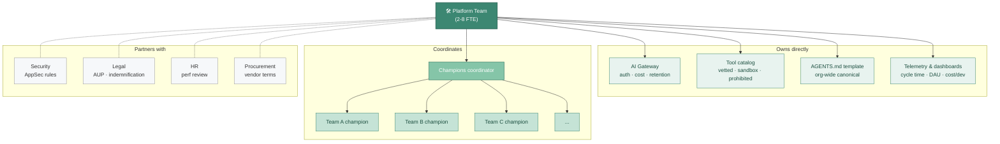

# Org Design and the Platform Team

The single most-quoted org-design observation I've made to peers in 2026: **Atlassian acquired DX for $1B in cash + restricted stock** ([announced Sept 2025, closed Nov 2025](https://techcrunch.com/2025/09/18/atlassian-acquires-dx-a-developer-productivity-platform-for-1b/)). Developer productivity *measurement* is now a board-level capability worth acquiring outright. That's the signal worth orienting around, the org that wins this isn't the one with the best AI tools; it's the one that knows whether the tools are working and adjusts.

The org pieces that actually matter, in order: the platform team's charter, the champions network, what to do about hiring and leveling, and the junior-pipeline question I get asked more than any other.

---

## The platform team, what it actually owns

I see two failure modes here. The first: AI tools live nowhere, every team picks their own, no shared infrastructure, no aggregated cost view, security finds out from incidents. The second: AI tools live in IT or InfoSec where the staffing model is "block first, support second," and you end up with shadow AI for the same reason ITIL teams used to drive shadow SaaS.

The version that works puts AI tooling in DevEx (or DevEx-adjacent), with an explicit charter. The cleanest public template is [Cloudflare's internal AI engineering stack post](https://blog.cloudflare.com/internal-ai-engineering-stack/), 3,683 internal users, 60% company-wide adoption (93% in R&D), every LLM request through their AI Gateway. The pattern they document is what I'd model from.

### Charter for an AI DevEx team

▴ Platform team at center; owns the technical infrastructure, coordinates the champions network (5-10% of engineers), partners with sec/legal/HR/procurement.

Pulled from Cloudflare, Atlassian/DX writeups, and what I've seen working at peer orgs:

| Area | What the team owns |
|---|---|
| **AI Gateway** | Centralized auth, cost tracking, retention policy enforcement. Every LLM request through one point. |
| **Tool catalog** | Vetted / sandboxed / prohibited tiers. Updated quarterly. The sanctioned set big enough that 90%+ of legitimate use cases have an in-bounds tool (the shadow AI mitigation). |
| **`AGENTS.md` template** | Org-wide canonical template (in `.github` repo or equivalent), with per-repo override pattern. Reviewed quarterly. |
| **Telemetry & rollout dashboards** | Cycle time, defect escape, daily active usage, cost per active dev. |
| **Champions network coordination** | One coordinator. See next section. |
| **Sec/legal/HR partnership** | Not ownership, but they're the connective tissue. AppSec rules tuned for AI patterns; AUP enforcement; performance-review implications. |
| **Internal training & enablement** | Onboarding new hires onto the AI stack; office hours; pattern library. |
| **Vendor relationship + procurement** | Negotiation, indemnification language, ZDR agreements where available. |

### Sizing

For a 200-engineer org at Level 2–3, I'd expect **2–3 FTEs** dedicated to this charter. At a 1,000-engineer org, **5–8 FTEs** plus a champions network. The mistake I see most often: trying to do all of this with 0.5 of an existing DevEx engineer. It doesn't work; the rollout stalls; the org regresses to Level 1.

---

## The AI champions network

The exemplar here is Citi's published model: 4,000+ AI Accelerators across 182,000 employees in 84 countries → 70%+ adoption of approved tools ([writeup via GitHub Resources](https://resources.github.com/enterprise/activating-internal-ai-champions/)). Champions spend 30–60 min/week, embedded in their normal job. The published ratios:

- **Suggested champion ratio: 5–10% of initial user base**
- **1 champion lead per 10–20 champions**

What a champion actually does (from what I've seen working):

1. **First responder for their team's AI questions**, not "the AI expert," just "the person who has read the patterns and knows where to send you."
2. **Pattern propagation**: when their team finds a workflow that works (a great `AGENTS.md` section, a custom skill that fits the team), they bring it to the champions sync for sharing.
3. **Adoption signal**: they tell the platform team what's friction and what's working, on the ground.
4. **Skill / memory hygiene**: they nudge their team to prune `~/.claude/CLAUDE.md`, audit installed skills, etc.

What a champion does *not* do:
- Sell the tools internally (don't make them salespeople)
- Carry quotas (don't make them metrics owners)
- Replace the platform team (they're the network, not the infrastructure)

---

## Hiring and leveling

This is the conversation I find hardest to have straight with CTO peers, because the data is mixed and the implications are uncomfortable.

The data points I keep returning to:
- BCG's "Rebuilding the Engineering Growth Ladder for an AI-First World" reframes career ladders around observable behaviors across 5–7 dimensions. The shift I'd take from it: from output volume (story points, lines, PRs) to *judgment as observable behavior* — what they decide *not* to do, what they catch in review, the quality of their `AGENTS.md`.
- The 2026 Pragmatic Engineer survey found Staff+ engineers are the heaviest agent users (63.5%) — more than ICs (49.7%), EMs (46.1%), or Directors/VPs (51.9%). Leverage scales with experience, which matches what I see.
- The 2025 LeadDev survey found 54% of engineering leaders plan to hire fewer junior engineers because seniors+AI cover more. Whether that's the right move is exactly the conversation in the next section.

What I'd actually do:
- **Update the leveling rubric** to include AI fluency as an explicit dimension (not "uses AI" — *judgment* about when to use AI, when not to, how to review AI output, how to teach others). Two-quarter rollout because rubrics changes are slow and political.
- **Promote based on impact, not output**, even more than before, the gap between high and low engineering judgment is wider than ever now that output volume is artificially equalized.
- **Hold senior engineers accountable for force multiplication**: a Staff engineer who's a heavy AI user but isn't propagating patterns to their team is delivering less value than one who is.

---

## The junior pipeline question

This is the question I get asked most, and the version I keep landing on:

The data is uncomfortable. Employment for software developers aged 22–25 declined nearly 20% from the late-2022 peak. Entry-level tech hiring fell ~25% YoY in 2024. The structural risk I'd point to — a hollowed-out career ladder, lots of seniors, AI doing the grunt work, no juniors learning craft — is real.

The counter-arguments I'd weigh against that:

AWS CEO Matt Garman has argued publicly that juniors are affordable, fast to adopt AI, and essential for pipeline continuity. I think he's directionally right: the hollowed-ladder risk is widely discussed but few have published programmatic responses.

Camille Fournier's May 2025 take is the one I'd send your EMs first: "vibe coding may become a skill that knowledge workers need," leading to *smaller engineering teams, not juniorization of the field*. She distinguishes greenfield (where junior-only orgs work) from established codebases (where they don't), which is the distinction I think most coverage misses.

What I'd do, in priority order:

1. **Don't hire fewer juniors than you have program capacity for.** If you can mentor 5 juniors, hire 5 juniors. If you can mentor 0, hire 0. The mentoring capacity, not the AI productivity, is the bottleneck.
2. **Adjust the junior onboarding curriculum.** Have juniors do their first pass without AI, then use AI to verify or extend their solution. Slower; necessary.
3. **Hold juniors to a different review bar.** Their PRs should be *smaller* than they used to be (they're checking in less mechanical code) and *more thoroughly explained* (the explanation is the learning).
4. **Rotate juniors through the platform team.** It's the highest-leverage exposure to "how AI fits into the org," not just "how to use AI."

---

## What I tell CTO peers about org design

The pattern that fails: hiring an "AI Lead" (or worse, a "Head of AI Engineering") with no platform team to support, no champions network to coordinate, and no measurement to point at. The role becomes a single point of failure and the rollout stalls within a quarter.

The pattern that works: stand up a small platform team (2–3 FTE for a mid-size org) inside DevEx, give it the charter above, fund a champions coordinator role explicitly, and let measurement adjust the rest. Most of the org-design work follows naturally from that.

If you do nothing else: **don't try to do this with 0.5 FTE.** It's the most common mistake I see and the most expensive one.

---

## Related reading

- [Maturity model](./maturity-model.md), what platform team capability looks like at Level 3
- [The 90-day roadmap](./90-day-roadmap.md), when to stand up the team
- [ROI and board narrative](./roi-and-board-narrative.md), how to budget for this
- [Junior developers (IC depth)](../08-team-and-adoption/junior-developers.md), the IC framing of the pipeline question
- [For team leads (IC depth)](../08-team-and-adoption/for-team-leads.md), the EM-level adjacent content
