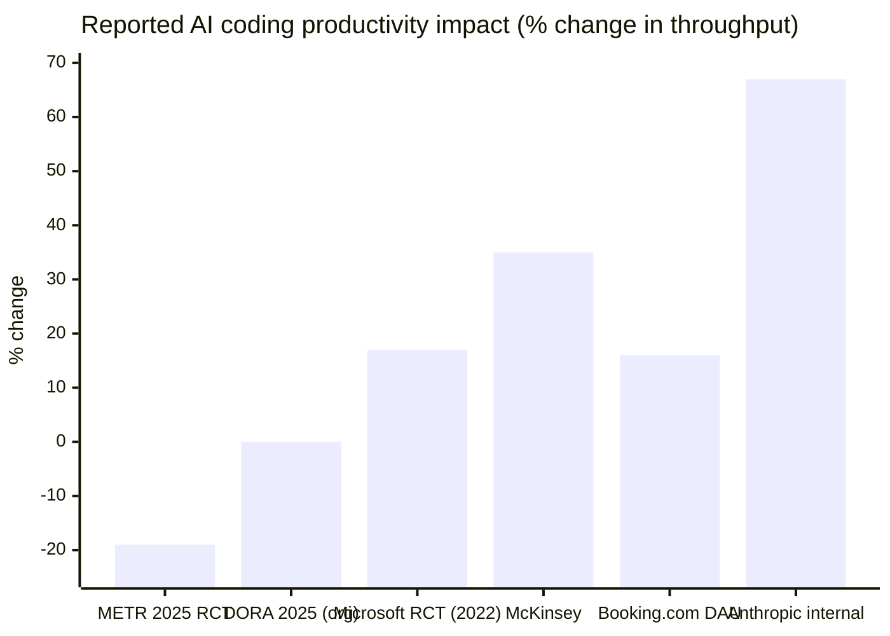

# ROI and the Board Narrative

> **TL;DR.** The productivity story is bimodal, vendor numbers (+50–67%) and skeptical numbers (METR −19%) are *both real* and a board narrative needs both. Use DX Core 4, not DORA alone. The flat per-seat era is ending: budget for usage (~$13/dev/active day), platform team headcount, and AppSec, base seats are ~4% of actual TCO.

I'll be blunt: most AI-coding metrics I see in board decks are useless. "% of code AI-generated" trends up forever and tells you nothing about delivery. "Developer satisfaction" is unreliable for the same reason METR found self-report unreliable on speed. If you build a board narrative on either, you'll either oversell (vendor numbers) or panic the room (METR numbers).

What follows is what I actually measure, how the cost picture quietly changed in 2026 in ways most TCO models haven't caught up to, and how to tell the story without lying.

---

## The bimodal productivity story


<p class="mermaid-caption">▴ The bimodal productivity range. METR (rigorous RCT) shows -19%; Anthropic internal shows +67%. Both are real. Your number is somewhere in this band, usually closer to METR/DORA than to vendor-self-reported.</p>

The picture, with sources on both sides:

| Side | Number | Source |
|---|---|---|
| **Vendor / optimistic** | Anthropic internal: +67% PRs/eng/day, +50% productivity (self-reported) | Anthropic 2026 internal report |
| | Microsoft Research RCT: 13–22% more PRs/week (statistically significant; experiment ran 2022, pre-current models) | Peng et al., 2023 |
| | McKinsey: up to 45% velocity increase | McKinsey Developer Velocity Index |
| | A16z portfolio: "10–20×" claims (unaudited) | A16z 2025 enterprise report |
| **Skeptical / our experience** | METR (July 2025): 19% slower in randomized controlled trial; developers *thought* they were 20% faster | [METR study](https://metr.org/blog/2025-07-10-early-2025-ai-experienced-os-dev-study/) |
| | METR (Feb 2026 update): −18% to −4% speedup with wide confidence intervals | METR follow-up |
| | DORA 2024–2025: individual output up (21% more tasks, 98% more PRs merged); organizational delivery metrics flat | [DORA 2025 report](https://dora.dev/dora-report-2025/) |
| | Stack Overflow 2025: 84% adoption, trust at all-time low (29%); 46% actively distrust AI accuracy | Stack Overflow Developer Survey |

The framing for your board:

> "Individual developer output is up 15–25% in our measurement. Organizational delivery throughput is roughly flat, the gain is being eaten by larger PRs, more review time, and more cleanup of subtly-wrong AI suggestions. We're investing in the practices that close that gap."

That sentence, or a variant of it, is what you want to be able to defend with data by Q2 2026. The specific things that close the gap (review discipline, AGENTS.md, AI-aware AppSec) are operational, not strategic.

---

## What to measure

### Beyond DORA

DORA (deployment frequency, lead time, change failure rate, MTTR) is necessary but no longer sufficient. The two newer frameworks worth knowing:

**SPACE (2021)**: Forsgren, Storey, Maddila, Zimmermann, Houck, Butler. Five dimensions: Satisfaction & well-being, Performance, Activity, Communication & collaboration, Efficiency & flow. Published in ACM Queue.

**DX Core 4 (Jan 2025)**: Tacho & Noda, with Forsgren / Storey / Zimmermann as advisors. Unifies DORA + SPACE + DevEx into 4 dimensions: Speed, Effectiveness, Quality, Business Impact. Tested across 300+ organizations. Reported outcomes: 3–12% engineering efficiency gains, 14% more R&D time on features.

For most engineering orgs, DX Core 4 is the right starting point in 2026. It's specifically designed to incorporate AI tool impact and gives you the four-dimensional balance that single-axis metrics miss.

### The three numbers that actually matter on your AI dashboard

If you only get three numbers on a slide, make them these:

1. **Cycle time** (from PR open to merge to deploy), your top-line throughput signal
2. **Defect escape rate** OR **post-merge cleanup volume**: your quality signal
3. **Daily active usage** of AI tools (12+ days/month, the Booking.com benchmark), your adoption signal

If cycle time improves while defect rate, cleanup volume, or senior-review burden rises, you don't have an efficiency gain. You have a deferred quality cost.

### The fourth number, for boards

4. **Cost per active developer per month**: your spend efficiency signal, especially under usage-based pricing (next section).

---

## TCO under usage-based pricing

The flat per-seat era is ending. Here's the April 2026 reality:

| Tool | Plan | Price | Notes |
|---|---|---|---|
| GitHub Copilot Business | per user/mo | $19 + $0.04/premium request | Token-based billing transition June 2026 |
| GitHub Copilot Enterprise | per user/mo | $39 + $0.04/premium request | $39 with $39 of pooled tokens after promo |
| Cursor Teams | per user/mo | $40 | $20 usage included per seat |
| Cursor Enterprise | per seat (custom) | Negotiated | Pooled usage, SCIM, audit logs |
| Claude Enterprise (Feb 2026) | per seat/mo | $20 (base) | Usage billed at API rates on top, major shift from old $200/seat flat |
| Anthropic-published Claude Code real-world spend | per dev | ~$13/active day, $150–250/dev/month | 90% of users under $30/active day |

### The TCO model that actually works

Old model (flat per-seat):
```
TCO = seats × per-seat × 12
```

New model (usage-based, what to actually budget):
```
TCO = (base seats × per-seat × 12)
    + (active developers × tokens-per-active-day × cost-per-token × active-days-per-year)
    + (platform team headcount × loaded cost)
    + (security/governance tooling)
    + (training & enablement)
```

The line items I see CTOs forget:
- **Platform team**: by Level 3 you have at least 1–3 FTEs dedicated to AI infrastructure. People forget to budget for the *people running the AI*.
- **Security tooling**: AppSec scanning specifically tuned for AI-introduced patterns. $50K–$500K/year depending on scale. This isn't optional past Level 2; the Apiiro 322% number makes that case for me.
- **Training & enablement**: non-trivial; the ROI of one good champions network coordinator is high and almost no one budgets for the role explicitly.

### A worked example (200-engineer org, mid-2026)

| Line item | Annual cost |
|---|---|
| 200 × Claude Enterprise base ($20/mo × 12) | $48,000 |
| 200 × ~$200/mo Claude Code usage × 12 | $480,000 |
| 50 × Cursor Pro for IDE-integrated work | $24,000 |
| Platform team (2 FTE × $250K loaded) | $500,000 |
| AppSec / AI scanning tooling | $150,000 |
| Champions network coordinator (0.25 FTE) | $62,500 |
| **Total annual TCO** | **~$1.26M** |

That's $6,300 per engineer per year, all-in. The base seat cost is ~4% of the actual TCO. I've watched too many vendor negotiations focus on the per-seat number, that's optimizing the wrong line item. The expensive ones are usage, the platform team, and AppSec.

---

## What to say to the board

A useful narrative is short, has three numbers, acknowledges the bimodal evidence, and ends with the operational discipline you're investing in.

### A 5-minute board update template

> **Where we are.** AI coding tools are deployed across [X]% of engineering, with daily active usage of [Y]%. That's [above/below] the Booking.com benchmark of 70%.
>
> **What we're seeing.** Individual developer output is up [X]% on cycle time. Organizational throughput [is up X% / is roughly flat]: the gap is [explanation: review burden / larger PRs / cleanup volume]. We're consistent with the DORA 2025 finding that the productivity paradox is real for orgs without strong measurement discipline.
>
> **What we're investing in.** [Three or four operational items: AGENTS.md across all repos, AppSec scanning tuned for AI patterns, champions network expansion, EU AI Act inventory.]
>
> **What I need from you.** [The board ask, usually budget for the platform team, sign-off on the AUP, or a regulatory-posture decision.]

### What NOT to say

- *"AI is going to make us 10× faster."* It isn't. Reading this back will make you look uninformed in 12 months.
- *"AI is going to let us ship the same with [N]% fewer engineers."* Even Anthropic's own CEO acknowledges that "if Claude is writing 90% of code, you usually need just as many engineers", the role shifts, not eliminates.
- *"The metrics show productivity is up X%."* Without the "but throughput is flat" caveat, this isn't honest. Board members talk to peers; the gap will get noticed.

---

## What I tell CTO peers about ROI

The most expensive mistake I see is *ROI theater*, picking a metric that always trends up (raw PR volume, lines of code, completions accepted), reporting it monthly, and watching it diverge from delivery reality.

Pick three to four metrics that *can* go down. Report them honestly. The downside is occasional uncomfortable quarters where you have to explain why a number dropped. The upside is institutional credibility, yours and your tooling investment's. The latter compounds.

If you take only one operational lesson from this page, take Booking.com's pivot from deployment to daily-active-usage as the success metric. Copy it.

---

## Related reading

- [Maturity model](./maturity-model.md), what "Operational" / "Compounding" looks like in measurement terms
- [Org design + platform team](./org-design.md), the headcount line items in the TCO model
- [Case studies](./case-studies.md), Booking.com's measurement pivot in detail
- [Measuring impact (IC depth)](../08-team-and-adoption/measuring-impact.md), DORA at the practitioner level
