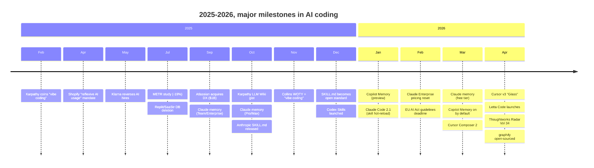

# Recent Updates (April 2026)

Things are changing fast. The tool updates mentioned in the [tools section](../02-tools/) all happened in the last few weeks. Here are a few additional developments worth noting.

▴ Major milestones, 2025-2026. The pace is unusual: three step-change shifts (memory, skills, knowledge graphs) in 18 months.

## Market Movements

- **Cursor hit $2B ARR**, doubled in three months. Bloomberg reported this in late March.
- **Claude Code** reportedly crossed $1B ARR in six months. If true, it's the fastest-growing developer tool ever.
- **GitHub Copilot** maintains roughly 42% market share despite new competition.
- **Google launched Antigravity IDE** in public preview, their answer to Cursor.

GitHub Agent HQ announced (February 2026). Run Claude, Codex, and Copilot simultaneously on the same task. [Cursor launched version 3 "Glass"](../02-tools/cursor.md) (April 2), replacing Composer with an Agents Window for parallel agent orchestration. Composer 2 shipped (March 19), Cursor's in-house model scoring 61.7 on Terminal-Bench 2.0. OpenAI released the official Codex plugin for [Claude Code](../02-tools/claude-code.md) (April), enabling cross-provider code review.

## Model News

**Claude Mythos leaked** (March 27). A configuration error revealed Anthropic is testing a new model described as "the most capable we've built to date." No official announcement yet.

## Memory went mainstream

The biggest under-the-radar story of early 2026, covered in depth in [07 — Memory](../07-memory/):

- **Claude memory** hit the free tier (March 2, 2026). Stored as user-editable markdown.
- **GitHub Copilot Memory** went on by default for Pro/Pro+ (March 4, 2026), with a 28-day TTL.
- **Letta Code** launched (April 6, 2026), the first major coding agent built memory-first.
- **claude-mem** crossed ~67K stars; effectively the standard third-party memory layer for Claude Code users.
- **Code-knowledge-graph projects** ([graphify](https://github.com/safishamsi/graphify) and [GitNexus](https://github.com/abhigyanpatwari/GitNexus)) emerged as a distinct sub-category — *artifact* memory rather than *interaction* memory.
- **Memory poisoning** became a top-tier risk: Microsoft's *AI Recommendation Poisoning* report (Feb 2026) documented 50+ companies silently injecting hidden memory instructions during normal browsing.

## New Research

The research findings cited throughout this guide all came out in the last few months. The METR study, Veracode security report, Georgia Tech Vibe Security Radar, and Black Duck OSSRA all published throughout 2025 and early 2026. The picture they paint is consistent: AI is generating more code, faster, but quality and security remain challenges.

## Regulatory Changes

- **[EU AI Act](https://eur-lex.europa.eu/eli/reg/2024/1689/oj/eng):** February 2026 marked the Commission's high-risk classification guidelines deadline; AI coding tools for safety-critical applications are now classified as "high-risk AI systems." Full applicability arrives August 2, 2026. See [REFERENCES.md](../REFERENCES.md#30-eu-ai-act).
- **FTC guidance:** Companies bear full legal responsibility for AI-generated code quality and security. The "AI wrote it" defense doesn't exist.

## Related reading

- [Cursor](../02-tools/cursor.md) and [Claude Code](../02-tools/claude-code.md), full tool pages with these updates in context
- [Security](../09-security/threat-landscape.md), the regulatory section in detail
- [What's coming](./whats-coming.md) where these trends are heading
