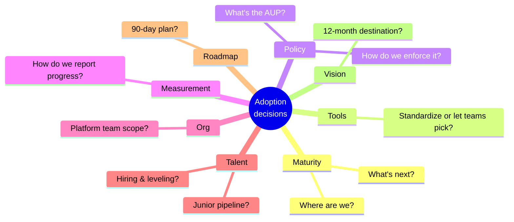

# Adoption: from one developer to the whole org

The rest of this guide is about using AI coding tools well as a practitioner. This folder is about the next problem: how do you take what works for you, and roll it out across an engineering org without losing the parts that make it work?

That's a different problem. Individual practice scales by reading, copying, and adapting. Org-level adoption scales by policy, platform, measurement, and a small number of recurring decisions that someone has to actually make. This folder covers those.

I wrote it because every time I shared the practitioner content with peer CTOs and VPEs, the same conversation followed: *"This is great, but I need the version I can use to roll this out at my company."* So here's that version. It assumes you've read or skimmed the practitioner folders; it doesn't repeat them.

Two warnings up front. First, most material aimed at this audience is either vendor-curated optimism ("10x productivity!") or pure skepticism ("METR says 19% slower!"), and neither is useful as a rollout plan. The honest picture is bimodal. Your job is to hold both numbers in your head at the same time. Second, I'm not a consultant and this isn't a deck. The pages are short, opinionated, and you'll find the practitioner depth one folder over wherever you want to verify or delegate.

## Five things that matter most

### 1. The productivity story is bimodal. Tell it that way.

I keep watching engineering leaders cite either the vendor numbers (Anthropic internal: 67% more PRs/eng/day; Microsoft RCT: 13–22% more PRs/week) *or* the skeptical numbers ([METR's 19% slower in a randomized controlled trial](https://metr.org/blog/2025-07-10-early-2025-ai-experienced-os-dev-study/); DORA's flat organizational delivery despite individual gains), and getting cornered when someone quotes the other side. Both numbers are real. Pick either in isolation and you'll be wrong.

The framing I use:

> "Individual developer output is up 15–25% in our measurement. Organizational delivery throughput is roughly flat. The gain is being eaten by larger PRs, more review time, and more cleanup of subtly-wrong AI suggestions. We're investing in the practices that close that gap."

### 2. Security is the headline risk and it's underweighted

Two numbers worth putting on any rollout slide. The first: AI-generated code introduced a 322% spike in privilege escalation paths in [Apiiro's Fortune 50 study](https://apiiro.com/blog/4x-velocity-10x-vulnerabilities-ai-coding-assistants-are-shipping-more-risks/). The second: [shadow-AI-related breaches cost $650K+ more than standard breaches and 1 in 5 organizations has had one](https://www.ibm.com/think/topics/shadow-ai). Together they make the directive unambiguous: if you're mandating AI coding, you must mandate AI AppSec in parallel. The full security picture lives in [09 — Security](../09-security/).

### 3. The EU AI Act August 2, 2026 deadline is real and underrated

Internal AI tools that affect workers (performance evaluation, task allocation, monitoring) may qualify as Annex III high-risk systems under the EU AI Act. Activation date for Articles 8–15 + Article 50 transparency: August 2, 2026. Penalties: €15M or 3% of global annual turnover.

Most engineering orgs don't have an inventory of AI systems in use, let alone a classification. If you have any EU footprint, this is a 2026 deliverable, not a 2027 one.

### 4. Vendor pricing has fundamentally shifted

The flat per-seat era is ending. GitHub Copilot moves to token-based billing in June 2026. Anthropic restructured Claude Enterprise pricing in February 2026 to $20/seat with usage billed on top, replacing the old $200/seat flat. Anthropic's own published benchmark for serious Claude Code users is roughly $13/dev/active day, $150–250/dev/month.

If your TCO model still assumes per-seat budgets, it's wrong.

### 5. The Klarna lesson generalizes

This is the one I bring up most often when peers ask "are we moving fast enough?" Klarna [announced in Feb 2024](https://www.entrepreneur.com/business-news/klarna-ceo-reverses-course-by-hiring-more-humans-not-ai/491396) that AI replaced 700 customer service agents. $40M annual savings, 75% of chats handled. By [May 2025 they were rehiring humans](https://mlq.ai/news/klarna-ceo-admits-aggressive-ai-job-cuts-went-too-far-starts-hiring-again-after-us-ipo/), citing quality drops. There's no equally severe AI-coding analog in public yet, but I'd bet the lesson generalizes: vendor productivity claims (75% of chats, 90% of code) routinely collapse on close inspection. When someone tells you AI will let you ship the same with 30% fewer engineers, the honest response is *"maybe, in three years, after a lot of operational work, and historically claims like this have not held up."*

## The eight decisions every adoption owner makes

▴ The eight recurring decisions on AI coding adoption. Each is covered in detail elsewhere in this folder.

Not in order of importance, in order of how often they come up:

1. What's our maturity level and what's next?
2. Should we standardize on one tool, or let teams pick?
3. What's the AUP and how do we enforce it?
4. How do we measure this for our stakeholders?
5. What does our platform team own?
6. What do we tell hiring about junior pipeline?
7. What's our 90-day plan?
8. What does success look like in 12 months?

## Reading paths

**5 minutes:** finish this page. Bookmark the 90-day roadmap and maturity assessment for later.

**30 minutes:** this page, then the maturity model, then risk/governance/policy, then take the assessment.

**Scoping a real rollout (2 hours):** all eight pages, the assessment, plus the templates folder. Then dip into the practitioner content where you need to delegate or verify.

**Sharing with peers:** forward the maturity assessment link directly. It's the single most-shared artifact for this audience in my experience.

## What's in this folder

- **Overview** *(this page)*, the 5-minute TL;DR
- **[AI coding maturity model](./maturity-model.md)**, an opinionated 6-level model with assessment criteria
- **[Risk, governance, policy](./risk-governance-policy.md)**, STRIDE-style threat model, EU AI Act mapping, AUP framing
- **[ROI and the case for investment](./roi-and-board-narrative.md)**, DX Core 4, TCO modeling, productivity-paradox framing
- **[Org design + platform team](./org-design.md)**, platform team scope, AI champions model, hiring/leveling
- **[The 90-day roadmap](./90-day-roadmap.md)**, concrete plans per maturity level
- **[Case studies](./case-studies.md)**, what worked and didn't at peer companies
- 📊 **[Maturity assessment](./assessment.md)**, 10 questions, your level plus 90-day actions
- **[Templates](./templates/)**, AUP, org-level AGENTS.md, code review checklist, vendor evaluation rubric, update-slide template, incident response runbook

## A note on voice

The adoption pages are written in the same first-person practitioner voice as the rest of the guide. Where I cite numbers, they're verified, with full citations in [REFERENCES.md](../REFERENCES.md). Where I'm sharing opinion or pattern, I say so. The synthesis is mine; the data isn't.

If you find a claim that doesn't hold up, [the repo is public](https://github.com/pochadri/ai-coding) and issues and PRs are welcome.
