# AI Coding Maturity Model

> **TL;DR.** Most engineering orgs are at Level 1 or 2 in early 2026. The right target is "one level higher than you are now, by year-end" and you climb by holding the boring discipline (measurement, AGENTS.md, code review updates, AUP enforcement, champions network), not by jumping levels.

I read all of them. [Gartner's AI-Native Software Engineering model](https://www.gartner.com/en/documents/7586633), Deloitte's 4-stage framework, BCG's AI Maturity Matrix, A16z's three-wave framing. They're fine, useful for a board deck, but I never reach for them when an engineering leader actually asks me "where are we, and what's next?" They're written one altitude too high. They miss the dimensions that determine whether an AI coding rollout actually works:

- Specific engineering practices (code review, CI, test infrastructure) as maturity criteria
- The platform team's role
- Security and governance integrated as a dimension, not a separate axis (the Apiiro 322% privilege-escalation finding makes "we'll deal with security later" a non-option)
- Junior pipeline preservation
- Multi-tool reality (the 2026 Pragmatic Engineer survey found 70% of teams use 2-4 tools simultaneously)

So here's the model I actually use, in six levels. Two things up front: most orgs I've talked to are at Level 1 or 2 in early 2026, and the honest answer to "where should we be" is almost always "one level higher than you are now, by year-end" and I mean that as a regulator, not an accelerant.

---

## The six levels at a glance

```mermaid
flowchart LR
    L0([0 · Unmanaged<br/>Shadow AI]):::level0
    L1([1 · Sanctioned<br/>AUP exists]):::level1
    L2([2 · Operational<br/>Measurement live]):::level2
    L3([3 · Platformed<br/>AI Gateway]):::level3
    L4([4 · Compounding<br/>Gains held 6mo+]):::level4
    L5([5 · Native<br/>Autonomous in scope]):::level5
    L0 --> L1 --> L2 --> L3 --> L4 --> L5

    classDef level0 fill:#f4f4f4,stroke:#999,color:#333
    classDef level1 fill:#e8f3ef,stroke:#3c8772,color:#1a4d3e
    classDef level2 fill:#c5e3d6,stroke:#3c8772,color:#1a4d3e
    classDef level3 fill:#85c5a8,stroke:#2d6b5a,color:#fff
    classDef level4 fill:#3c8772,stroke:#2d6b5a,color:#fff
    classDef level5 fill:#2d6b5a,stroke:#1a4d3e,color:#fff
```

▴ The six levels with progression. Most orgs are at Level 1 or 2 in early 2026; Level 4 is the realistic destination.

| Level | Name | Adoption | Governance | Measurement | Org capability |
|---|---|---|---|---|---|
| **0** | Unmanaged | Personal accounts, ad hoc | None | None | Individual experimentation |
| **1** | Sanctioned | Approved tools available | AUP exists; lightly enforced | Self-report only | Some champions; no team |
| **2** | Operational | Used by majority of devs | AUP enforced; AGENTS.md per repo | DORA + at least one AI-specific metric | DevEx team owns AI tooling |
| **3** | Platformed | Centralized AI Gateway, tool catalog | Security scanning integrated; audit trails | DX Core 4 + token-cost-per-active-day | Dedicated platform team + champions network |
| **4** | Compounding | Measurable productivity gains held over 6+ months | Vendor risk reviewed; cyber insurance includes AI | Cycle time, defect escape, daily active usage all tracked | Hiring/leveling reflects AI fluency; junior pipeline preserved |
| **5** | Native | Autonomous agents in narrow well-bounded domains | EU AI Act / SOC 2 audit-ready; signed configs | Real-time dashboards; ROI visible quarterly | AI is part of the engineering operating model, not a project |

Each level is described in detail below, with criteria, what's working, what's missing, and the next step.

---

## Level 0 — Unmanaged

You know you're here when developers are using ChatGPT or Claude on personal accounts, nobody knows what tools are in use, there's no AUP, security and legal haven't been consulted, and you'd struggle to answer "how much do we spend on AI coding tools?" because the answer is "in expense reports."

This is more common than people admit. I've sat in too many "we haven't really adopted AI yet" conversations where the engineers in the room had ChatGPT Plus on their personal accounts and were pasting code into it daily. Netskope's 2025 Cloud and Threat Report found 47% of GenAI platform users access these tools through personal, unmonitored accounts. That includes engineers at orgs that *think* they don't use AI yet.

What's working at Level 0: developers are getting some lift; you're not paying for it. What's missing: everything, security review, IP indemnity (none on personal accounts), audit trail, cost visibility, anything that would survive a SOC 2 inquiry.

The single highest-leverage move at this stage is *not* a tool selection, it's a 30-day shadow-AI inventory. You can't sanction what you haven't catalogued.

---

## Level 1 — Sanctioned

If you'd asked me in early 2026 to bet on where the average mid-size enterprise sat, I'd have said Level 1, every time. The signs are easy: there's an approved tool (Copilot or Cursor, usually), the AUP lives somewhere on the wiki, security and legal signed off in some quarter long enough ago that nobody quite remembers when, developers are mostly using the thing and nobody is consistently measuring whether any of it is working.

The reason Level 1 is sticky is that it *feels* like the work is done. Vendor chosen. Lawyers happy. Devs not complaining. The board has a slide that says "AI adoption: 73%." Everything looks fine.

Three things are usually missing, and they're the same three things every time. Most repos don't have an `AGENTS.md`. Code review practices haven't been updated for AI-generated code. Measurement is self-reported, and self-report is unreliable — METR's developers thought they were 20% faster while actually 19% slower.

To get to Level 2, do exactly three things, in order: deploy DX Core 4 (or DORA + daily-active-usage), require a starter `AGENTS.md` template in every repo, and update the code review checklist for AI-generated code.

---

## Level 2 — Operational

Operational means the AUP is *actually enforced* (not just published), every repo has an `AGENTS.md`, code review is genuinely updated for AI, you can answer "what's our daily active usage rate" with real data, and a DevEx team owns AI tooling as a charter item rather than as a side project. The clearest published example is Booking.com, three thousand developers, the right pivot from deployment metrics to usage metrics, the kind of measurement discipline that distinguishes "we have AI tools" from "we have AI tools that work."

The Level 2 trap is comfort. You have measurement. You have governance. You shipped the wins. The bill is predictable enough. It's tempting to call it done.

It isn't done because what you have is a *single engineer holding it together*. The AGENTS.md template lives on her hard drive. The dashboard breaks every other Tuesday and only she knows how to fix it. The cost visibility is a Looker query someone wrote four months ago. Security scanning catches the obvious AI regressions but misses the non-obvious ones. And there are maybe two enthusiasts in the org who'd qualify as "champions", both are senior engineers, both will leave if their next promo doesn't land, and the organization has no resilience against either departure.

To get to Level 3 you stand up a real platform team (2-3 FTE for a 200-eng org, more for larger) and give it a charter that includes the AI Gateway pattern. Cloudflare's published model is what I'd model from.

---

## Level 3 — Platformed

This is where engineering *infrastructure* meets AI tooling. A centralized AI Gateway routes every LLM request through one point, auth, cost tracking, retention policy enforcement, audit trail in the same flow. A vetted tool catalog publishes the sandbox / approved / prohibited tiers and gets refreshed quarterly. The champions network is staffed at the Citi-published ratio — 5-10% of the engineering org, with explicit time allocation. Security scanning is tuned for AI patterns, not just generic SAST. Audit trails are sufficient for a SOC 2 conversation that doesn't end in panic.

Cloudflare publicly demonstrated this level and the rest of the industry is still catching up. They're a useful proof point: the AI Gateway pattern works at scale and the cost discipline holds.

What you don't have yet is the durability story. The productivity gains are real but only three or four months old. Hiring and leveling haven't been updated to reflect AI fluency as a competency. The 54% of leaders planning fewer junior hires (per LeadDev's 2025 survey) is real pressure on the junior pipeline, but you don't have a programmatic response yet, just intentions. Vendor risk is reviewed annually rather than at the cadence a CFO would expect.

The next quarter is about *holding the discipline*, same measurement, same governance, same champions cadence, two more quarters in a row. The temptation to add novelty is the failure mode here.

---

## Level 4 — Compounding

This is the level the original "AI productivity" pitch implicitly promised and the level few organizations actually reach. The platform discipline of Level 3 has held for six months or more, the productivity numbers have moved without quality regressions, AI fluency is in the engineering career ladder (BCG's reframing around observable behaviors is the right starting point), the junior-pipeline question has a documented answer (Camille Fournier's "smaller teams, not juniorization" framing is one defensible position; pick yours), cyber insurance covers AI vectors explicitly, and vendor risk reviews land in board materials.

I keep [Gartner's June 2025 finding](https://www.gartner.com/en/newsroom/press-releases/2025-06-30-gartner-survey-finds-forty-five-percent-of-organizations-with-high-artificial-intelligence-maturity-keep-artificial-intelligence-projects-operational-for-at-least-three-years) close: only 45% of high-AI-maturity organizations keep AI projects operational for 3+ years. Most orgs that *reach* Level 4 don't *hold* Level 4. The discipline that compounds is unglamorous, same measurement, same governance, same investment, quarter after quarter. Boring is the strategy.

What you'd push past for Level 5 is autonomous agent deployment in narrow domains, EU AI Act audit-ready posture continuously rather than at audit time, and signed/policy-as-code agent configs. Most engineering orgs should treat Level 4 as the destination.

---

## Level 5 — Native

You know you're here when autonomous agents run in narrow, well-bounded domains (legacy migration, dependency upgrades, test scaffolding) with measured outcomes; AI is part of the engineering operating model, not a project, not a mandate, not a transformation; the EU AI Act / SOC 2 / cyber insurance posture is audit-ready continuously, not just at audit time; signed agent configs and policy-as-code are standard.

Goldman Sachs' announced Devin pilot for autonomous code migration alongside ~12,000 human developers is the most-public Level 5 attempt. No public outcome data yet, worth tracking.

What's working at Level 5: AI is no longer a strategic question; it's infrastructure. What's missing: anything beyond this is research, not engineering management. Honestly, most CTOs shouldn't be here. Level 5 is an order of magnitude more operational complexity than Level 4 for incremental gain. I'd treat Level 4 as the destination unless AI coding is core to the operating model which for most engineering orgs, it isn't.

---

## A note on the alignment dimension

The model above measures the *governance and platform* axis of maturity. There's a parallel axis I'm increasingly convinced matters as much: **team alignment around agent work**. Most orgs at Level 2 or 3 still run agents in single-player mode (one developer, private session, the team sees the work for the first time when the PR opens). That's structurally bad and the next-generation tools won't fix it on their own.

A team-alignment maturity progression that runs alongside the levels above:

- **L0-1:** agent sessions are entirely private; PRs are the only shared surface; no team plan-before-prompt practice.
- **L2:** plans for non-trivial work are checked-in artifacts (markdown in the repo, ticket descriptions, etc.) before code is written. AGENTS.md captures team conventions.
- **L3:** "shared planning" sessions (a teammate joins the agent's plan-mode for non-trivial work) are an established practice. Some agent harnesses run in shared modes for higher-stakes work.
- **L4:** the team has adopted multiplayer agent sessions (ACE-class tooling or homegrown equivalents) for any work above a defined complexity threshold; agent sessions are linkable artifacts the whole team can review during, not after.
- **L5:** the team's collaboration surface and the agent's collaboration surface are the same surface. Agents and humans are in the same room, with the same context, by default.

Most orgs are at L0-1 on this axis even when they're at L2-3 on the governance axis. See [the alignment bottleneck](../10-team-and-process/alignment-bottleneck.md) for what to do today, before ACE-class tools are mature.

---

## What I tell CTO peers when they ask "where should we be?"

The honest answer is **one level higher than you are now, by year-end** and I mean it as a regulator, not an accelerant. I've seen orgs jump from Level 1 to "we're doing Level 4 things" without ever building the Level 2 measurement discipline, and the result is always the same: optimistic vendor metrics, real productivity claims that don't hold up under scrutiny, security incidents nobody saw coming, and a board that loses confidence.

The discipline that compounds is the boring stuff, measurement, AGENTS.md, code review updates, AUP enforcement, champions network. None of it is interesting in isolation. All of it determines whether you're at Level 4 in two years or still at Level 1.

---

## Related reading

- 📊 [Interactive maturity assessment](./assessment.md), your level + 90-day actions
- [The 90-day roadmap](./90-day-roadmap.md), concrete plans per level
- [Risk, governance, policy](./risk-governance-policy.md), what Level 2+ requires
- [Org design](./org-design.md), what a Level 3 platform team looks like
