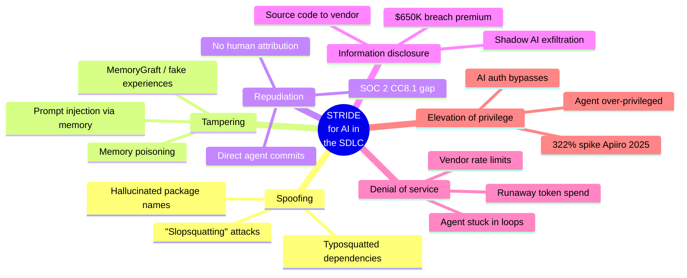

# Risk, Governance, and Policy

> **TL;DR.** AI-generated code introduced a 322% spike in privilege escalation paths (Apiiro Fortune 50 study), *if you mandate AI coding, you must mandate AI AppSec in parallel*. EU AI Act August 2 2026 deadline is real. Shadow AI breaches cost +$650K. The AUP your legal team signs off on should fit on one page and address the six STRIDE categories.

The single most important number in this whole guide for a CTO audience is from [Apiiro's June 2025 study of Fortune 50 codebases](https://apiiro.com/blog/4x-velocity-10x-vulnerabilities-ai-coding-assistants-are-shipping-more-risks/): AI-generated code introduced 10,000+ new security findings/month, a 10× spike vs Dec 2024. Trivial syntax errors dropped 76%, but privilege escalation paths jumped 322% and architectural design flaws spiked 153%. I quote that number more than any other in this guide. It's the one that makes "we'll deal with security later" indefensible.

Pair it with [IBM's 2025 finding that shadow-AI-related breaches cost $650K+ more than standard breaches and 1 in 5 organizations has had one](https://www.ibm.com/think/topics/shadow-ai), and the directive writes itself: if you're mandating AI coding, you must mandate AI AppSec in parallel. Anything else is incomplete.

Here's the framework for doing that, plus the regulatory and IP context you need to actually set policy.

---

## The threat model — AI in the SDLC, STRIDE-style

I keep coming back to the [STRIDE taxonomy](https://learn.microsoft.com/en-us/azure/security/develop/threat-modeling-tool-threats) when peers ask me what their AUP needs to cover, because it's the only way I've found to systematically not miss a category. The six letters — Spoofing, Tampering, Repudiation, Information disclosure, Denial of service, Elevation of privilege, map cleanly to what actually goes wrong with AI in the SDLC.

▴ STRIDE mapped to AI in the SDLC. The most-skipped categories in published AUPs are Tampering (memory poisoning) and Repudiation (the "AI did it" attribution gap).

The table below is the version I keep bookmarked.

| STRIDE category | What it looks like with AI coding | Real example | Mitigation |
|---|---|---|---|
| **Spoofing** | Hallucinated package names that attackers register as malware | "Slopsquatting" attacks; typosquatted PDF parsing packages | Verify every AI-suggested dependency against the registry before install; CI dependency scanning |
| **Tampering** | Memory poisoning, attacker injects content that becomes persistent agent memory | Microsoft AI Recommendation Poisoning report (Feb 2026), 50+ companies silently injecting hidden memory instructions; MemoryGraft (Dec 2025) | Treat memory writes from external content as untrusted; TTL on memory; transparent (auditable) memory layers |
| **Repudiation** | AI-generated code with no traceable author / no audit trail | Common pattern: agent commits directly without workflow enforcement; SOC 2 CC8.1 gap | Every AI-generated change attributable to an authorized session; require commit metadata identifying the AI tool used |
| **Information disclosure** | Source code / secrets sent to vendor; shadow-AI exfiltration | Netskope 2025: 47% of GenAI users on personal accounts; IBM +$650K breach premium for shadow AI | AI Gateway pattern (centralized routing, retention policy enforcement); Zero Data Retention vendor agreements where available |
| **Denial of service** | Agent gets stuck in expensive loops; token spend spikes; rate-limited at vendor | Common in autonomous agent deployments; requires runaway-cost detection | Per-session and per-day token caps; vendor budget alerts; circuit breakers on autonomous agents |
| **Elevation of privilege** | AI generates code that introduces new auth bypasses | Apiiro: 322% spike in privilege escalation paths | AppSec scanning specifically tuned for AI patterns; mandatory human review on auth/permissions code |

The most common AUP failure mode I see is *missing one of the six*. Spoofing usually gets covered. Information disclosure too. Privilege escalation often does. The ones that get skipped are Tampering (memory poisoning isn't on most teams' radar yet) and Repudiation (the "AI did it" attribution gap). Make sure all six get a sentence in your policy.

---

## The EU AI Act for engineering leaders

Critical date: **August 2, 2026**: Articles 8–15 high-risk obligations + Article 50 transparency requirements activate. Penalties: €15M or 3% of global annual turnover. ([Official text](https://eur-lex.europa.eu/eli/reg/2024/1689/oj/eng).)

### What an in-house engineering org actually needs to do

Most coverage focuses on the AI Act's implications for AI vendors. The implications for in-house engineering orgs are what I see CTOs miss most often. Worth being concrete:

Internal AI tools that affect workers, performance evaluation, task allocation, monitoring, code review automation that affects evaluations — *may* qualify as Annex III high-risk systems (Annex III item 4 covers employment, workers management, and access to self-employment). The classification is interpretation-dependent and there's genuine legal uncertainty about whether code-review automation specifically qualifies, get specialized counsel for your specific use cases. If high-risk classification applies, requirements include:

1. Automatic event logging built in from the ground up, not bolted on
2. Human oversight mechanisms, also not bolted on
3. Technical documentation across the lifecycle
4. Conformity assessments before "market placement" (which can mean internal deployment)
5. CE marking + EU database registration

The gap: over half of organizations lack systematic inventories of AI systems in use. You can't classify what you haven't inventoried. I keep meeting CTOs who think this is a 2027 problem; it isn't. This is a 2026 deliverable and Step 1 (the inventory) is exactly what gets you from Level 0 to Level 1 in the maturity model anyway. You're going to do it; you might as well let regulatory pressure pay for it.

### What's NOT high-risk (and is therefore much lighter touch)

A coding assistant used purely for code generation, where developers review and own the output, is generally not Annex III. Productivity-tooling AI is also generally not high-risk. Most of what your engineering org actually uses falls in the lighter regime, but the transparency obligations under Article 50 still apply (e.g., users must be informed when interacting with AI in synthesized content).

The honest read: most engineering orgs have one or two AI uses that *are* high-risk (anything touching HR, evaluation, monitoring), and a majority that aren't. Inventory first; classify second.

---

## IP indemnification, the vendor reality

A board will ask "what's our exposure if AI-generated code infringes someone's copyright?" The honest answer in April 2026:

**GitHub Copilot** offers Copyright Commitment indemnification for unmodified suggestions, only when the duplication-detection filter is enabled. Microsoft did not update standard contracts to reflect this; you have to ask. Kate Downing's legal analysis covers the actual scope.

**Sourcegraph Cody Enterprise** offers uncapped indemnity, no model training on customer data, zero data retention, among the most aggressive vendor positions.

**Anthropic Claude Enterprise** can negotiate Zero Data Retention. As of April 2026, Claude Cowork (the chat product) had no EU data residency option, a real gap for German/EU enterprises. Vendor data residency changes monthly; verify before quoting.

**Cursor / Windsurf** indemnification language is less mature; check current terms.

What to actually do:
1. For any vendor under serious consideration, get the indemnification language from the contract, not the marketing site
2. Verify your AI tool has any required filters enabled (Copilot's duplication detector)
3. Push for indemnification scope that covers *modified* output, not just verbatim
4. Get explicit data-handling commitments in writing (training, retention, residency)

---

## Shadow AI, the risk most CTOs underestimate

Netskope's 2025 Cloud and Threat Report found 47% of GenAI platform users access these tools through personal, unmonitored accounts. Harmonic Security found 665 distinct GenAI tools across enterprise environments; only 40% of companies had purchased official AI subscriptions. Over 80% of employees use unapproved AI tools.

Cost impact, per IBM's 2025 Cost of a Data Breach Report: +$650K per breach when shadow AI is involved, and 1 in 5 organizations has had a breach linked to shadow AI.

The mitigation is not "block all unapproved tools", that pushes shadow AI deeper. It's:

1. **Inventory monthly.** Network egress to known AI vendor domains, browser extension audits, expense report review for AI subscriptions.
2. **Sanction generously.** Make the approved set big enough that 90%+ of legitimate use cases have an in-bounds tool. Approved-but-unused isn't shadow AI; unapproved-because-no-option is.
3. **Make the AUP pragmatic.** "Don't paste customer data into ChatGPT" is enforceable. "Don't use any unapproved tool" is not.
4. **Centralize where you can.** The Cloudflare AI Gateway pattern, every LLM request through one point, converts shadow AI into measurable AI.

---

## Cyber insurance is starting to ask

Underwriting in 2025-2026 has shifted. Underwriters now ask which AI models are in use, the decision-making process for tool selection, and verification mechanisms for AI-generated output.

Endorsements emerging: Coalition (2025) added an AI endorsement in their base cyber policy plus a deepfake response endorsement. AXA XL (Oct 2025) added a Generative AI risk endorsement for businesses developing their own gen AI.

The coverage gap: many existing cyber policies *implicitly* exclude AI-specific vectors (prompt injection, model poisoning, autonomous decision errors). "Silent AI" coverage, meaning ambiguous coverage in incidents, is the dominant pattern.

What to do: schedule a 30-minute call with your cyber insurance broker specifically on AI exposure. Ask for explicit (not silent) AI coverage at renewal. Treat indemnification + insurance as a layered risk story for the board.

---

## SOC 2 implications

Auditors in 2025-2026 are focused on CC8.1 (change management) for AI-generated code. Specifically:

- AI-generated code attributable to specific authorized sessions/users
- Least-privilege access to AI agents (the agent shouldn't have broader access than the human user it acts for)
- Continuous monitoring logs proving agents operate within parameters
- AI-generated code goes through the same review/approval as human code
- Incident response procedures for AI-introduced vulnerabilities

The compliance gap that auditors are flagging: when agents commit directly without workflow enforcement, "no human request" is a major accountability gap. SOC 2 expects privileged actions attributable to an accountable individual.

---

## What an AUP should actually contain

A useful AUP fits on one page. The categories that matter, in priority order:

1. **What's approved** (and how the list is updated)
2. **What's prohibited** (data classes, use cases, regions)
3. **The required workflow** (no commits from agents without human review; AGENTS.md per repo; etc.)
4. **The audit obligations** (what gets logged, who can see it)
5. **What happens when something goes wrong** (incident response, escalation)

A fork-able starting point is in the templates folder, not legal advice, but a useful base your legal team can compress.

---

## What I tell CTO peers about governance

Two patterns I see fail.

Pattern 1: *"We'll write the policy, then deploy."* What actually happens: the policy is two months late, devs adopt unsanctioned tools in the meantime, and you're now governing shadow AI rather than the rollout you intended.

Pattern 2: *"We'll deploy, then write the policy when we hit something."* What actually happens: you hit something, but the something is a security incident, not a polite training opportunity.

The version that works: deploy a small approved set in week 1, ship the AUP in week 4, audit shadow AI in week 8, integrate with security scanning in week 12. Governance and rollout are concurrent, not sequential.

---

## Related reading

- [AUP template](./templates/aup.md), fork-able starting point
- [Org design + platform team](./org-design.md), who owns this
- [The 90-day roadmap](./90-day-roadmap.md), sequencing
- [Security (IC depth)](../09-security/threat-landscape.md), the practitioner-level treatment
